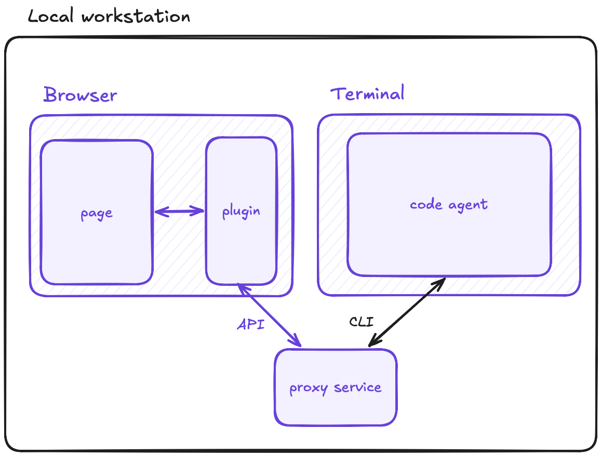

# bproxy

Browser proxy for code agents. A localhost daemon bridges a CLI to a Chrome extension running in your real browser, so coding agents can navigate, read, and fill pages from the same session you're already signed into.

Playwright-style automation gets blocked by Cloudflare, Datadome, and friends because it runs in a detectable automated browser. bproxy keeps the agent out of the page entirely: real Chrome, real cookies, real fingerprint. The default mode (**read mode**) has no MAIN-world presence — no wrapped globals, no MutationObserver, no history patches. URL-driven navigation, ISOLATED-world DOM reads, paste-flavored writes. Interstitials (CAPTCHAs, sign-in walls) hand control back to you via a structured `HUMAN_REQUIRED` signal.

## Status

Design phase — no code yet. The repository currently contains the architecture, decisions, and solution specs that will drive implementation.

```
Code Agent ──CLI──▶ Proxy Daemon ◀──WebSocket──▶ Browser Extension ◀──▶ Page
```



## Documentation

- [docs/architecture.md](docs/architecture.md) — system shape, components, protocol, principles
- [docs/decisions.md](docs/decisions.md) — ADRs (why we chose X over Y), append-only
- [docs/scenarios.md](docs/scenarios.md) — driving use cases (Google research, LinkedIn snapshot, form fill) with bot-signal accounting
- [docs/solution/](docs/solution/) — implementation specs for the extension, daemon, CLI, and shared types
- [docs/journal/](docs/journal/) — raw design thinking and pivot notes

## License

[MIT](LICENSE)
