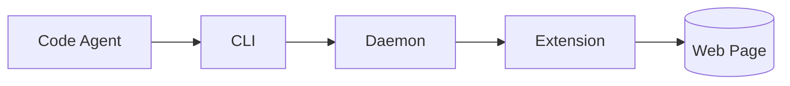
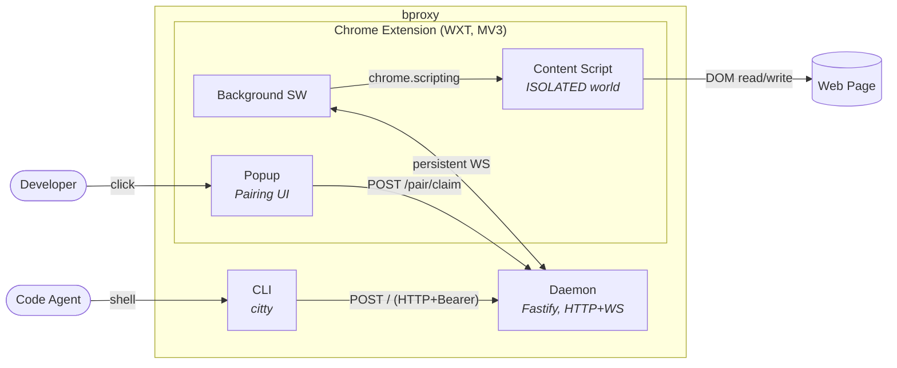

> **For agentic workers:** REQUIRED SUB-SKILL: Use superpowers:subagent-driven-development (recommended) or superpowers:executing-plans to implement this plan task-by-task. Steps use checkbox (`- [ ]`) syntax for tracking.

**Goal:** Stand up the architecture views site (Astro Starlight wrapper that renders existing prose docs plus a canonical Container diagram) and the two advisory sync helpers (`views:audit`, `views:regen`) so the rest of the build has a visual onboarding surface from day one and so drift detection is wired before any production code lands.

**Strategy:** Bottom-up, minimal viable wrapper first. The monorepo skeleton and `views/` workspace are stood up with the lightest tooling that lets Astro Starlight run. Full quality-gate tooling (Biome, ESLint, dep-cruiser, knip, `pnpm check`) is **deferred to Phase 1**, which retrofits the entire workspace when production code lands. Phase 0.7 ships a working site + helpers + one canonical diagram; the other five intent diagrams arrive as evolutionary updates after this phase.

**Spec:** [`docs/solution/views.md`](../../solution/views.md). **Roadmap entry:** [Phase 0.7 in roadmap.md](../roadmap.md#phase-07--architecture-viewer-v1).

**Tech Stack:** pnpm workspaces · Astro 6 · Astro Starlight 0.39+ · Mermaid 11 via CDN + inline remark plugin (no `rehype-mermaid` — it carries a Playwright peer dep) · Zod 4 (imported directly so the audit CLI can reuse the same schema as Astro) · `js-yaml` for frontmatter parsing · Vitest 4 · TypeScript 6 · `dependency-cruiser` (invoked by `views:regen`).

---

## Locked outcomes for this phase

1. **One workspace added:** `views/`. The other workspaces (`shared/`, `service/`, `extension/`, `cli/`) arrive in Phase 1.
2. **One canonical diagram authored:** `docs/views/02-containers.md`. The other five intent diagrams (Context, Deployment, Session State, Scenarios, Threat Model) land in evolutionary updates, not this phase.
3. **Sync helpers ship stable contracts in this phase.** Both `views:audit` and `views:regen` exist, have tests, and are wired as pnpm scripts. `views:regen` ships as a working no-op with a tested planner API; dependency-cruiser execution wiring is explicitly deferred to Phase 1.
4. **Build-time schema validation is the contract.** Astro's Zod-validated content collection fails the build on malformed frontmatter. The same schema is imported by `views:audit` — single source of truth.
5. **No `pnpm check` umbrella.** Phase 1 owns the full quality-gate stack. Phase 0.7 uses Astro's built-in typecheck plus Vitest for sync-helper tests.
6. **CI catches build failures, does not deploy.** GitHub Pages workflow is deferred.

## Inputs

- Spec: [`docs/solution/views.md`](../../solution/views.md)
- Roadmap entry: [Phase 0.7](../roadmap.md#phase-07--architecture-viewer-v1)
- Quality-gate ADR (deferred enforcement, but tsconfig settings inform tsconfig.base.json): [`docs/quality-gates.md`](../../quality-gates.md)
- Architecture context: [`docs/architecture.md`](../../architecture.md)

## File structure introduced this phase

```
.
├── pnpm-workspace.yaml          # NEW — declares views/ workspace
├── package.json                 # NEW — root, scripts proxy into views/
├── tsconfig.base.json           # NEW — shared compiler options
├── .gitignore                   # MODIFIED — adds node_modules, dist, .astro
├── .github/
│   └── workflows/
│       └── docs.yml             # NEW — runs pnpm docs:build on PR
├── docs/
│   ├── decisions.md             # MODIFIED — appends ADR-019 and ADR-020
│   ├── plans/roadmap.md         # MODIFIED (already done) — Phase 0.7 entry
│   └── views/                   # NEW — diagram content
│       └── 02-containers.md     # NEW — canonical Container view
└── views/                       # NEW — workspace
    ├── package.json
    ├── tsconfig.json
    ├── astro.config.mjs
    ├── README.md
    ├── src/
    │   ├── content.config.ts    # Zod schemas (docs + views collections)
    │   ├── lib/
    │   │   └── view-schema.ts   # Re-export of viewSchema for audit/regen
    │   ├── components/
    │   │   └── RelatedAdrs.astro
    │   └── styles/
    │       └── custom.css       # minimal theme tweaks
    └── scripts/
        ├── audit.ts             # views:audit
        ├── audit.test.ts
        ├── regen.ts             # views:regen
        └── regen.test.ts
```

---

## Task 1: Monorepo skeleton

**Files:**
- Create: `pnpm-workspace.yaml`
- Create: `package.json` (root)
- Create: `tsconfig.base.json`
- Modify: `.gitignore`

**Purpose:** Add the minimum scaffolding so a `views/` workspace can exist. No tooling beyond what `views/` itself needs.

- [x] **Step 1: Write `pnpm-workspace.yaml`**

```yaml
packages:
  - views
```

- [x] **Step 2: Write root `package.json`**

```json
{
  "name": "bproxy",
  "private": true,
  "version": "0.0.0",
  "description": "Browser proxy for code agents.",
  "license": "MIT",
  "packageManager": "pnpm@9.15.0",
  "scripts": {
    "docs:dev": "pnpm --filter views dev",
    "docs:build": "pnpm --filter views build",
    "views:audit": "pnpm --filter views audit",
    "views:regen": "pnpm --filter views regen",
    "test": "pnpm --filter views test"
  },
  "engines": {
    "node": ">=22.12"
  }
}
```

- [x] **Step 3: Write `tsconfig.base.json`**

Compiler settings come from [`docs/quality-gates.md`](../../quality-gates.md). Workspace tsconfigs extend this file.

```json
{
  "compilerOptions": {
    "strict": true,
    "noUncheckedIndexedAccess": true,
    "noImplicitOverride": true,
    "noFallthroughCasesInSwitch": true,
    "noPropertyAccessFromIndexSignature": true,
    "isolatedModules": true,
    "verbatimModuleSyntax": true,
    "module": "ESNext",
    "moduleResolution": "bundler",
    "target": "ES2022",
    "lib": ["ES2022", "DOM"],
    "skipLibCheck": true,
    "resolveJsonModule": true
  }
}
```

- [x] **Step 4: Append to `.gitignore`**

The file already gitignores `.superpowers/`. Append:

```
node_modules/
**/dist/
**/.astro/
**/.cache/
*.tsbuildinfo
```

- [x] **Step 5: Verify `pnpm install` succeeds**

Run:
```bash
pnpm install
```
Expected: exits 0, no errors. `pnpm-lock.yaml` is written at repo root.

- [x] **Step 6: Commit**

```bash
git add pnpm-workspace.yaml package.json tsconfig.base.json .gitignore pnpm-lock.yaml
git commit -m "build: add pnpm monorepo skeleton for views workspace"
```

---

## Task 2: Document architectural commitments — ADR-019 and ADR-020

**Files:**
- Modify: `docs/decisions.md`

**Purpose:** Document the brainstorm decisions before code commits to them. ADR-019 captures the toolchain (Astro Starlight + Mermaid + advisory sync helpers); ADR-020 captures the layering model (C4 spine + Diátaxis IA).

The existing decisions.md is the 2026-05-13 edition; append both ADRs after ADR-018.

- [x] **Step 1: Add ADR-019 to `docs/decisions.md`**

Append after ADR-018:

```markdown
## ADR-019: Architecture views toolchain — Astro Starlight + Mermaid + advisory sync helpers
**Date:** 2026-05-13
**Status:** Accepted

**Decision:** The architecture views artifact is rendered by [Astro Starlight](https://starlight.astro.build) reading existing markdown plus a curated set of [Mermaid](https://mermaid.js.org) diagrams under `docs/views/`. Two advisory pnpm scripts (`views:audit`, `views:regen`) surface drift; neither blocks CI.

**Rationale:**
- Starlight is TS-native, fits the project's TypeScript-only stance ([ADR-005](#adr-005-typescript-as-project-language)), and ships Zod-validated content collections — the schema doubles as the contract for the sync audit script.
- Mermaid renders with one CDN import or one SSG plugin; sources stay as text in markdown, so coding agents reading the raw files see the same content the site renders. Diagram-as-code preserved.
- Likec4 (DSL-driven, multi-view) was evaluated and rejected: no native SVG renderer (PNG export goes through headless Chromium via Playwright); embed path requires React + PandaCSS as peer dependencies; runs its own viewer instead of acting as a renderer-embedded library. The agent-queryable benefit is mostly achievable by parsing Mermaid sources or a small manifest.
- Drift detection is advisory at this stage of the project lifecycle ([Phase 0.7](./plans/roadmap.md#phase-07--architecture-viewer-v1)) — manual updates before merge are sufficient; helpers report what changed without gating.

**Notation constraint:** Mermaid's experimental `C4Container` syntax is not used — render fails inconsistently. Container/Context/Deployment views are authored as `flowchart` with named subgraphs; C4 vocabulary lives in node labels and arrow captions.

**Scope:** Six curated diagrams (Context, Container, Deployment, Session State, Scenarios, Threat Model) plus auto-derived component graphs via `dependency-cruiser` ([ADR-012](#adr-012-static-analysis-stack)). See [`docs/solution/views.md`](./solution/views.md) for the implementation spec.

---
```

- [x] **Step 2: Add ADR-020 to `docs/decisions.md`**

Append after ADR-019:

```markdown
## ADR-020: Architecture views layering — C4 spine with Diátaxis IA
**Date:** 2026-05-13
**Status:** Accepted

**Decision:** The architecture views site uses the [C4 model](https://c4model.com) as the layering spine (Context → Container → Component → Code) and [Diátaxis](https://diataxis.fr) as the broader information-architecture frame for surrounding prose (explanation / reference / how-to / tutorial).

**Mapping for bproxy:**
- **C1 Context** — Code Agent, Developer, bproxy, Web Page
- **C2 Container** — CLI, Daemon, Extension (Background SW / Content Script / Popup)
- **C3 Component** — Daemon internals (auth, pacing, ws-hub, pending-map, sessions); Extension internals (tab-router, frame-table, read primitives, write methods)
- **C4 Code** — file-level dependency graphs per workspace, auto-generated by `dependency-cruiser`

**Cross-cutting indexes (not layers):** Protocol envelope, Actions catalog, ADRs, Scenarios — linked from each view's footer.

**Diátaxis mapping for existing docs:**
- `docs/views/` + `architecture.md` → explanation
- `solution/*.md` → reference
- `scenarios.md` + `docs/views/05-scenarios/` → how-to
- _(gap)_ → tutorial — added when the daemon exists and an end-to-end walkthrough is real

**Alternatives rejected:** Role-based layering (Scenarios → Capabilities → Components → Files) was considered but rejected because bproxy's structural decomposition is already clean C4 territory; flat topic-based IA matches today's docs but offers no layered ascent. ArchiMate, full UML, and DDD context maps were considered and rejected as inappropriate-for-scale.

---
```

- [x] **Step 3: Verify both ADRs parse and link**

Run:
```bash
grep -n "^## ADR-" docs/decisions.md | tail -5
```
Expected: lines ending in `ADR-017`, `ADR-018`, `ADR-019`, `ADR-020`.

Run:
```bash
grep -nE "\(#adr-005|\(#adr-012\)" docs/decisions.md | head -5
```
Expected: the new ADRs' internal links resolve to existing anchors.

- [x] **Step 4: Commit**

```bash
git add docs/decisions.md
git commit -m "docs: add ADR-019 (views toolchain) and ADR-020 (views layering)"
```

---

## Task 3: Bootstrap the `views/` workspace with Astro Starlight

**Files:**
- Create: `views/package.json`
- Create: `views/tsconfig.json`
- Create: `views/astro.config.mjs`
- Create: `views/README.md`
- Create: `views/src/styles/custom.css` (empty file; theming hook for later)

**Purpose:** Install Astro + Starlight and confirm a bare site builds and serves. No content yet — that's the next tasks.

- [x] **Step 1: Write `views/package.json`**

```json
{
  "name": "@bproxy/views",
  "private": true,
  "version": "0.0.0",
  "type": "module",
  "scripts": {
    "dev": "astro dev",
    "build": "astro build",
    "preview": "astro preview",
    "typecheck": "astro check",
    "audit": "tsx scripts/audit.ts",
    "regen": "tsx scripts/regen.ts",
    "test": "vitest run"
  },
  "dependencies": {
    "@astrojs/starlight": "^0.39.2",
    "astro": "^6.3.1",
    "js-yaml": "^4.1.1",
    "minimatch": "^10.2.5",
    "rehype-mermaid": "^3.0.0",
    "zod": "^4.4.3"
  },
  "devDependencies": {
    "@types/js-yaml": "^4.0.9",
    "@types/node": "^25.7.0",
    "tsx": "^4.21.0",
    "typescript": "^6.0.3",
    "vitest": "^4.1.6"
  }
}
```

- [x] **Step 2: Write `views/tsconfig.json`**

```json
{
  "extends": ["../tsconfig.base.json", "astro/tsconfigs/strict"],
  "include": [".astro/types.d.ts", "**/*.ts", "**/*.tsx", "**/*.astro", "src/**/*.css"],
  "exclude": ["dist", "node_modules"]
}
```

- [x] **Step 3: Write `views/astro.config.mjs`**

This file evolves in Task 4 (Mermaid) and Task 5 (collections). Start with the minimal Starlight integration.

```javascript
import { defineConfig } from 'astro/config';
import starlight from '@astrojs/starlight';

export default defineConfig({
  integrations: [
    starlight({
      title: 'bproxy — Architecture',
      description: 'Architecture views and design docs for bproxy.',
      sidebar: [
        // populated in Task 6
      ],
      customCss: ['./src/styles/custom.css'],
    }),
  ],
});
```

- [x] **Step 4: Write `views/README.md`**

```markdown
# @bproxy/views

Astro Starlight site that renders bproxy's architecture views and existing prose docs. Plus two advisory sync helpers (`views:audit`, `views:regen`) that surface drift between the artifact and the codebase.

**Spec:** [`docs/solution/views.md`](../docs/solution/views.md)
**Decisions:** [ADR-019](../docs/decisions.md#adr-019-architecture-views-toolchain--astro-starlight--mermaid--advisory-sync-helpers), [ADR-020](../docs/decisions.md#adr-020-architecture-views-layering--c4-spine-with-diátaxis-ia)

## Local development

```bash
pnpm install                 # from repo root
pnpm docs:dev                # Astro dev server on http://localhost:4321
pnpm docs:build              # Static build to views/dist/
```

## Sync helpers

```bash
pnpm views:audit             # Report which views' declared sources changed in this branch
pnpm views:regen             # Regenerate component dep-graphs (no-op until source code exists)
```
```

- [x] **Step 5: Create empty `views/src/styles/custom.css`**

```css
/* Theme tweaks land here as needed. Empty by intent — Starlight defaults are good. */
```

- [x] **Step 6: Install dependencies and verify dev server boots**

Run:
```bash
pnpm install
pnpm --filter views dev
```
Expected: Astro reports server running on `http://localhost:4321`. Open the URL: site renders Starlight default landing page with no sidebar entries (sidebar config is empty). Stop the dev server with Ctrl-C.

- [x] **Step 7: Verify build succeeds**

Run:
```bash
pnpm docs:build
```
Expected: exits 0, writes static assets to `views/dist/`.

- [x] **Step 8: Commit**

```bash
git add views/ pnpm-lock.yaml
git commit -m "build(views): bootstrap workspace with Astro Starlight"
```

---

## Task 4: Mermaid integration — smoke-test a diagram renders

**Files:**
- Modify: `views/astro.config.mjs`
- Create: `views/src/content/docs/index.md` (temporary smoke-test page; replaced by sidebar config in Task 6)

**Purpose:** Wire Mermaid so fenced ` ```mermaid ` blocks render client-side at runtime. Verify with the simplest possible diagram before authoring the real Container view.

**No `rehype-mermaid`.** That package lists `playwright` as a peer dependency (via its `mermaid-isomorphic` dependency) regardless of which rendering strategy is used. Playwright is not permitted in this project. Instead, we inline a 12-line remark plugin that converts mermaid code blocks to `<pre class="mermaid">` elements — exactly what `rehype-mermaid`'s `pre-mermaid` strategy does, at zero dependency cost. Mermaid's CDN ESM bundle handles the client-side render.

- [x] **Step 1: Update `views/astro.config.mjs` to register the inline remark plugin**

```javascript
import { defineConfig } from 'astro/config';
import starlight from '@astrojs/starlight';

/** Converts ```mermaid fenced blocks to <pre class="mermaid"> for CDN rendering. */
function remarkMermaid() {
  return (tree) => {
    function walk(node) {
      if (node.children) {
        for (let i = 0; i < node.children.length; i++) {
          const child = node.children[i];
          if (child.type === 'code' && child.lang === 'mermaid') {
            node.children[i] = { type: 'html', value: `<pre class="mermaid">${child.value}</pre>` };
          } else {
            walk(child);
          }
        }
      }
    }
    walk(tree);
  };
}

export default defineConfig({
  markdown: {
    remarkPlugins: [remarkMermaid],
    syntaxHighlight: { excludeLangs: ['mermaid'] },
  },
  integrations: [
    starlight({
      title: 'bproxy — Architecture',
      description: 'Architecture views and design docs for bproxy.',
      sidebar: [],
      customCss: ['./src/styles/custom.css'],
      head: [
        {
          tag: 'script',
          attrs: { type: 'module' },
          content: `
            import mermaid from 'https://cdn.jsdelivr.net/npm/mermaid@11/dist/mermaid.esm.min.mjs';
            mermaid.initialize({ startOnLoad: true, theme: 'neutral', securityLevel: 'loose' });
          `,
        },
      ],
    }),
  ],
});
```

- [x] **Step 2: Create a smoke-test page at `views/src/content/docs/index.md`**

```markdown
---
title: bproxy — Architecture
description: Layered architecture views for bproxy.
---

This is the smoke-test landing page; replaced by sidebar config in a later task.


```

- [x] **Step 3: Run dev server and verify the diagram renders in the browser**

Run:
```bash
pnpm docs:dev
```
Open `http://localhost:4321`. Expected: the page shows the smoke-test diagram as an SVG (5 boxes with arrows). Stop the server.

- [x] **Step 4: Verify build succeeds with the Mermaid block**

Run:
```bash
pnpm docs:build
```
Expected: exits 0; `views/dist/index.html` contains a `<pre class="mermaid">…flowchart LR…</pre>` block ready for client-side render.

Run:
```bash
grep -c 'class="mermaid"' views/dist/index.html
```
Expected: prints `1` (one Mermaid block).

- [x] **Step 5: Commit**

```bash
git add views/astro.config.mjs views/src/content/docs/index.md pnpm-lock.yaml
git commit -m "build(views): wire inline remark-mermaid plugin + CDN runtime for fenced diagrams"
```

---

## Task 5: Content collections — Zod schemas for `docs` and `views`

**Files:**
- Create: `views/src/content.config.ts`
- Create: `views/src/lib/view-schema.ts`
- Delete: `views/src/content/docs/index.md` (replaced by external loaders)

**Purpose:** Define the two content collections (`docs` and `views`) that source from `../docs/` and `../docs/views/` respectively. The `viewSchema` Zod schema is the contract for the audit script — same import in two places.

- [x] **Step 1: Write `views/src/content.config.ts`**

```typescript
import { defineCollection } from 'astro:content';
import { docsSchema } from '@astrojs/starlight/schema';
import { glob } from 'astro/loaders';
import { viewSchema } from './lib/view-schema';

const docs = defineCollection({
  loader: glob({
    pattern: ['**/*.{md,mdx}', '!views/**'],
    base: '../docs',
  }),
  schema: docsSchema(),
});

const views = defineCollection({
  loader: glob({
    pattern: '**/*.md',
    base: '../docs/views',
  }),
  schema: docsSchema({ extend: viewSchema }),
});

export const collections = { docs, views };
```

- [x] **Step 2: Write `views/src/lib/view-schema.ts`**

```typescript
import { z } from 'zod';

export const viewLayer = z.enum(['c1', 'c2', 'c3', 'c4', 'behavior', 'threat']);
export type ViewLayer = z.infer<typeof viewLayer>;

export const viewSchema = z.object({
  layer: viewLayer,
  sources: z.array(z.string()).min(1),
  relatedAdrs: z.array(z.string().regex(/^ADR-\d{3}$/)).optional(),
  related: z.array(z.string()).optional(),
});

export type ViewFrontmatter = z.infer<typeof viewSchema>;
```

> **Why `import { z } from 'zod'` instead of `'astro:content'`:** the audit CLI runs in plain Node via tsx. The `astro:content` virtual module only resolves inside an Astro build, so a schema rooted there cannot be reused by the audit. Importing `zod` directly is what makes "no second-source schema" actually true. Astro's `docsSchema({ extend: viewSchema })` accepts any Zod schema regardless of which `zod` instance constructed it.

- [x] **Step 3: Delete the smoke-test landing page**

```bash
rm views/src/content/docs/index.md
rmdir views/src/content/docs 2>/dev/null || true
rmdir views/src/content 2>/dev/null || true
```

- [x] **Step 4: Run `astro check` to validate schemas + verify collections load**

Run:
```bash
pnpm --filter views typecheck
```
Expected: exits 0 (no type errors). If `astro:content` types are missing, Astro will regenerate them on the next dev/build run.

- [x] **Step 5: Verify dev server picks up existing docs**

Run:
```bash
pnpm docs:dev
```
Expected: the dev server starts. Visit `http://localhost:4321/architecture/`. Expected: the existing `docs/architecture.md` renders (sidebar still empty at this point — that's Task 6). Stop the server.

> If Astro complains that `architecture.md` is missing a `title` frontmatter field that Starlight requires, that's expected — Task 6 addresses it via a sidebar config that doesn't require frontmatter changes to the existing prose docs.

- [x] **Step 6: Commit**

```bash
git add views/src/content.config.ts views/src/lib/view-schema.ts
git rm -rf views/src/content
git commit -m "feat(views): add docs + views content collections with shared view schema"
```

---

## Task 6: Sidebar — surface existing prose docs and the views collection

**Files:**
- Modify: `views/astro.config.mjs`

**Purpose:** Configure Starlight's sidebar to render the existing prose docs and the views collection in a sensible order. The sidebar IS the layer ladder ([ADR-020](../../decisions.md#adr-020)) — order matters.

- [x] **Step 1: Configure title fallback for prose docs without frontmatter**

Many existing prose docs (architecture.md, decisions.md, scenarios.md, solution/*.md) lead with `# Title` and have no frontmatter. Starlight's docs collection requires a `title:` frontmatter field by default. We adjust the schema first, so sidebar verification does not fail mid-task.

Edit `views/src/content.config.ts`:

```typescript
import { defineCollection, z } from 'astro:content';
import { docsSchema } from '@astrojs/starlight/schema';
import { glob } from 'astro/loaders';
import { viewSchema } from './lib/view-schema';

const docs = defineCollection({
  loader: glob({
    pattern: ['**/*.{md,mdx}', '!views/**'],
    base: '../docs',
  }),
  // `extend` makes `title` optional — Starlight falls back to the first H1.
  schema: docsSchema({
    extend: z.object({ title: z.string().optional() }),
  }),
});

const views = defineCollection({
  loader: glob({
    pattern: '**/*.md',
    base: '../docs/views',
  }),
  schema: docsSchema({ extend: viewSchema }),
});

export const collections = { docs, views };
```

> Note: Starlight uses the page's first `<h1>` as the title when `title` is absent. This is the documented fallback path and does not require touching existing docs.

- [x] **Step 2: Update sidebar config in `views/astro.config.mjs`**

Replace the `sidebar: [],` line with:

```javascript
      sidebar: [
        {
          label: 'Overview',
          items: [
            { label: 'README', link: '/' },
            { label: 'Architecture', link: '/architecture/' },
            { label: 'Scenarios', link: '/scenarios/' },
          ],
        },
        {
          label: 'Views',
          collapsed: false,
          autogenerate: { directory: 'views' },
        },
        {
          label: 'Solution Specs',
          autogenerate: { directory: 'solution' },
        },
        {
          label: 'Reference',
          items: [
            { label: 'Decisions (ADRs)', link: '/decisions/' },
            { label: 'Quality Gates', link: '/quality-gates/' },
          ],
        },
        {
          label: 'Plans',
          collapsed: true,
          items: [
            { label: 'Roadmap', link: '/plans/roadmap/' },
            {
              label: 'Phases',
              autogenerate: { directory: 'plans/phases' },
            },
          ],
        },
      ],
```

- [x] **Step 3: Run dev server and verify all docs are reachable**

```bash
pnpm docs:dev
```

Expected behavior at `http://localhost:4321`:
- Sidebar shows the five groups above.
- Clicking "Architecture" loads the existing `docs/architecture.md`.
- Clicking "Decisions (ADRs)" loads the existing `docs/decisions.md`.
- "Solution Specs" lists the four files in `docs/solution/` (extension, cli, service, shared, views).
- "Views" auto-generates but is empty until Task 7 adds `02-containers.md`.
- No "missing title" errors for existing prose docs.

Stop the server.

- [x] **Step 4: Re-run `pnpm docs:build` and verify**

```bash
pnpm docs:build
```
Expected: exits 0 with sidebar config + title fallback in place.

- [x] **Step 5: Commit**

```bash
git add views/astro.config.mjs views/src/content.config.ts
git commit -m "feat(views): configure sidebar IA and title fallback for existing prose docs"
```

---

## Task 7: Author the canonical Container view

**Files:**
- Create: `docs/views/02-containers.md`

**Purpose:** Ship the one diagram this phase commits to ([spec § Diagram Set](../../solution/views.md#diagram-set)). The Container view is the canonical bproxy artifact — most navigation will flow through it.

- [x] **Step 1: Write `docs/views/02-containers.md`**

```markdown
---
title: Containers
layer: c2
sources:
  - shared/**
  - service/src/**
  - extension/src/**
  - cli/src/**
  - docs/architecture.md
relatedAdrs: [ADR-003, ADR-008, ADR-010, ADR-013, ADR-017]
related: [01-context, 03-deployment]
---

# Containers

The three runtime processes and how they communicate. This is the canonical bproxy diagram — every later view either zooms into one of the boxes below (Component-level) or describes a slice of behaviour that crosses them (Sequence, State).



## What this picture tells you

- **Three processes, four protocols.** The CLI talks HTTP to the Daemon. The Daemon talks WebSocket to the Extension's Background SW. The SW dispatches into Content Scripts via `chrome.scripting`. The Content Script reads and writes the page via the DOM. Two distinct authentication tokens secure the two daemon-facing routes ([ADR-010](../../decisions.md#adr-010-websocket-auth-transport--two-token-model)).
- **The agent never sees the page.** Only the Content Script touches the DOM, in the page's ISOLATED world. MAIN-world execution is on-demand and one-shot ([ADR-013](../../decisions.md#adr-013-main-world-runtime-api-writes)).
- **The user is a participant.** Pairing is popup-driven ([ADR-011](../../decisions.md#adr-011-extension-token-bootstrap-via-popup-driven-pairing)) — the CLI doesn't talk directly to the extension.

## See also

- Inside the Daemon: _coming in a later view._ Component-level breakdown will live at `docs/views/auto/daemon-components.svg` once Phase 2+ generates it.
- Inside the Extension: _coming in a later view._ Same shape.
- Trust boundaries and where each process runs: _Deployment view, coming in a later phase._
```

- [x] **Step 2: Verify the view renders with frontmatter validation passing**

```bash
pnpm docs:dev
```
Open `http://localhost:4321/views/02-containers/`. Expected:
- The page renders the Container diagram as SVG.
- The page is reachable via the sidebar's "Views" group.
- No build errors about malformed frontmatter (the Zod schema accepts the `layer`, `sources`, `relatedAdrs`, `related` fields).

- [x] **Step 3: Negative test — break the frontmatter and confirm the build fails**

Temporarily change `layer: c2` to `layer: invalid` in the file. Run:
```bash
pnpm docs:build
```
Expected: build exits non-zero with a Zod validation error mentioning `layer`.

Restore `layer: c2` and re-build:
```bash
pnpm docs:build
```
Expected: exits 0.

- [x] **Step 4: Commit**

```bash
git add docs/views/02-containers.md
git commit -m "docs(views): add canonical Container view (C2)"
```

---

## Task 8: `RelatedAdrs` component — render related ADRs in view footers

**Files:**
- Create: `views/src/components/RelatedAdrs.astro`
- Create: `views/src/components/PageFrame.astro`
- Modify: `views/astro.config.mjs` (register the override)

**Purpose:** Show "Decisions behind this view: ADR-007, ADR-013…" as live links in the footer of every view that declares `relatedAdrs`. Specified in [`docs/solution/views.md` § Interactivity](../../solution/views.md#interactivity).

- [x] **Step 1: Write `views/src/components/RelatedAdrs.astro`**

```astro
---
interface Props {
  adrs?: readonly string[] | undefined;
}

const { adrs } = Astro.props;
const list = Array.isArray(adrs) ? adrs : [];
---

{list.length > 0 && (
  <aside class="related-adrs">
    <strong>Decisions behind this view:</strong>
    <ul>
      {list.map((id: string) => (
        <li>
          <a href={`/decisions/#${id.toLowerCase()}`}>{id}</a>
        </li>
      ))}
    </ul>
  </aside>
)}

<style>
  .related-adrs {
    margin-top: 2rem;
    padding: 0.75rem 1rem;
    border-left: 3px solid var(--sl-color-accent, #1f6feb);
    background: var(--sl-color-bg-nav, transparent);
    font-size: 0.9rem;
  }
  .related-adrs ul {
    list-style: none;
    padding: 0;
    margin: 0.25rem 0 0;
    display: flex;
    gap: 0.5rem;
    flex-wrap: wrap;
  }
</style>
```

- [x] **Step 2: Write `views/src/components/PageFrame.astro`**

This wraps Starlight's default PageFrame and appends `RelatedAdrs` after the main content.

```astro
---
import Default from '@astrojs/starlight/components/PageFrame.astro';
import RelatedAdrs from './RelatedAdrs.astro';

const { entry } = Astro.locals.starlightRoute;
// `relatedAdrs` is only present on entries from the `views` collection.
const adrs = (entry.data as { relatedAdrs?: readonly string[] }).relatedAdrs;
---

<Default {...Astro.props}>
  <slot />
  <RelatedAdrs adrs={adrs} />
</Default>
```

- [x] **Step 3: Register the component override in `views/astro.config.mjs`**

Inside the `starlight({…})` config object, add:

```javascript
      components: {
        PageFrame: './src/components/PageFrame.astro',
      },
```

- [x] **Step 4: Verify the footer renders on the Container view**

```bash
pnpm docs:dev
```
Open `http://localhost:4321/views/02-containers/`. Scroll to the bottom. Expected: a sidebar-styled box reading "Decisions behind this view:" with five chips (ADR-003, ADR-008, ADR-010, ADR-013, ADR-017), each linking into the decisions page.

Click one ADR link. Expected: navigates to `/decisions/` and the browser jumps to the anchor (the anchor format Starlight generates is the slug of the ADR's H2 — links may or may not align cleanly to existing anchors in `decisions.md`. If anchors don't resolve, the link lands at the top of the decisions page, which is acceptable for v1).

- [x] **Step 5: Open the existing `docs/architecture.md` in the site**

Expected: the footer does NOT render the related-ADRs box (because the docs collection's entries have no `relatedAdrs` field). The conditional render in the component handles this.

- [x] **Step 6: Commit**

```bash
git add views/src/components/ views/astro.config.mjs
git commit -m "feat(views): add RelatedAdrs footer component for view pages"
```

---

## Task 9: `views:audit` script — TDD

**Files:**
- Create: `views/scripts/audit.ts`
- Create: `views/scripts/audit.test.ts`

**Purpose:** Given a git diff (default: `git diff --name-only origin/main...HEAD`), report which views' declared `sources` were touched and whether the view file itself was also touched in the same branch. Pure advisory — no exit code change based on findings.

The script splits into a **pure function** (`auditViews`) and a thin CLI wrapper. Tests target the pure function.

- [x] **Step 1: Write the failing test `views/scripts/audit.test.ts`**

The test covers two surfaces: `loadView` (frontmatter parsing + Zod validation against the same `viewSchema` Astro uses at build time) and `auditViews` (the pure diff/glob matcher).

```typescript
import { describe, expect, it } from 'vitest';
import { auditViews, loadView, type View } from './audit';

describe('loadView', () => {
  it('parses valid frontmatter and returns a typed view', () => {
    const content = `---
layer: c2
sources:
  - service/src/**
  - shared/**
relatedAdrs: [ADR-007]
---

# Containers
`;
    const result = loadView('docs/views/02-containers.md', content);
    expect('data' in result).toBe(true);
    if ('data' in result) {
      expect(result.slug).toBe('02-containers');
      expect(result.data.layer).toBe('c2');
      expect(result.data.sources).toEqual(['service/src/**', 'shared/**']);
      expect(result.data.relatedAdrs).toEqual(['ADR-007']);
    }
  });

  it('surfaces a structured error when a required field is missing', () => {
    const content = `---
layer: c2
---

# missing sources
`;
    const result = loadView('docs/views/broken.md', content);
    expect('error' in result).toBe(true);
    if ('error' in result) {
      expect(result.error).toMatch(/sources/i);
    }
  });

  it('surfaces a structured error when layer has an invalid value', () => {
    const content = `---
layer: not-a-layer
sources: [service/src/**]
---
`;
    const result = loadView('docs/views/broken.md', content);
    expect('error' in result).toBe(true);
    if ('error' in result) {
      expect(result.error).toMatch(/layer/);
    }
  });

  it('surfaces an error when no frontmatter block is present', () => {
    const result = loadView('docs/views/broken.md', '# just a title\n');
    expect('error' in result).toBe(true);
    if ('error' in result) {
      expect(result.error).toMatch(/frontmatter/i);
    }
  });

  it('surfaces an error on malformed YAML', () => {
    const content = `---
layer: c2
sources:
  - service/src/**
  this is not valid yaml: : :
---
`;
    const result = loadView('docs/views/broken.md', content);
    expect('error' in result).toBe(true);
  });
});

describe('auditViews', () => {
  const views: View[] = [
    {
      slug: '02-containers',
      path: 'docs/views/02-containers.md',
      sources: ['shared/**', 'service/src/**'],
    },
    {
      slug: '03-deployment',
      path: 'docs/views/03-deployment.md',
      sources: ['extension/manifest.json'],
    },
    {
      slug: '06-threat-model',
      path: 'docs/views/06-threat-model.md',
      sources: ['service/src/auth.ts'],
    },
  ];

  it('reports clean when no source globs match the diff', () => {
    const report = auditViews(views, ['README.md', 'tsconfig.json']);
    expect(report.affected).toEqual([]);
    expect(report.clean.map(v => v.slug)).toEqual(['02-containers', '03-deployment', '06-threat-model']);
  });

  it('flags a view whose source glob matches a changed file and the view itself is untouched', () => {
    const report = auditViews(views, ['service/src/auth.ts']);
    expect(report.affected).toHaveLength(2); // matches 02-containers (service/src/**) and 06-threat-model (exact)
    const containers = report.affected.find(a => a.view.slug === '02-containers');
    expect(containers).toBeDefined();
    expect(containers?.viewTouched).toBe(false);
    expect(containers?.matchedSources).toContain('service/src/auth.ts');
  });

  it('marks the view as touched when the diff also includes the view file', () => {
    const report = auditViews(views, ['service/src/auth.ts', 'docs/views/06-threat-model.md']);
    const threat = report.affected.find(a => a.view.slug === '06-threat-model');
    expect(threat?.viewTouched).toBe(true);
  });

  it('handles glob patterns including double-star', () => {
    const report = auditViews(views, ['shared/protocol/envelope.ts']);
    const containers = report.affected.find(a => a.view.slug === '02-containers');
    expect(containers).toBeDefined();
    expect(containers?.matchedSources).toEqual(['shared/protocol/envelope.ts']);
  });

  it('returns an empty affected list when sources are empty (defensive)', () => {
    const report = auditViews(
      [{ slug: 'edge', path: 'docs/views/edge.md', sources: [] }],
      ['service/src/auth.ts'],
    );
    expect(report.affected).toEqual([]);
  });
});
```

- [x] **Step 2: Run the test to confirm it fails**

```bash
pnpm --filter views test
```
Expected: FAIL — `Cannot find module './audit'` (or similar).

- [x] **Step 3: Implement `loadView`, `auditViews`, and the CLI wrapper in `views/scripts/audit.ts`**

`loadView` parses frontmatter with `js-yaml` and validates against the same `viewSchema` Astro consumes at build time — single source of truth. `auditViews` stays pure (diff in, report out). The CLI composes both and prints the result.

```typescript
#!/usr/bin/env tsx
import { execSync } from 'node:child_process';
import { readFileSync, readdirSync, statSync } from 'node:fs';
import { dirname, join, relative, resolve } from 'node:path';
import { fileURLToPath } from 'node:url';
import { load as yamlLoad } from 'js-yaml';
import { minimatch } from 'minimatch';
import { viewSchema, type ViewFrontmatter } from '../src/lib/view-schema';

export interface View {
  slug: string;
  path: string;
  sources: readonly string[];
}

export interface AffectedView {
  view: View;
  matchedSources: readonly string[];
  viewTouched: boolean;
}

export interface AuditReport {
  affected: readonly AffectedView[];
  clean: readonly View[];
}

export interface LoadedView {
  slug: string;
  path: string;
  data: ViewFrontmatter;
}

export interface LoadError {
  path: string;
  error: string;
}

export function loadView(path: string, content: string): LoadedView | LoadError {
  const match = content.match(/^---\n([\s\S]*?)\n---/);
  if (!match) return { path, error: 'no YAML frontmatter block' };
  let parsed: unknown;
  try {
    parsed = yamlLoad(match[1] ?? '');
  } catch (e) {
    return { path, error: `YAML parse error: ${(e as Error).message}` };
  }
  const result = viewSchema.safeParse(parsed);
  if (!result.success) {
    const issue = result.error.issues[0];
    const field = issue?.path.join('.') || '(root)';
    return { path, error: `${field}: ${issue?.message ?? 'invalid'}` };
  }
  const slug = path.split('/').pop()?.replace(/\.md$/, '') ?? path;
  return { slug, path, data: result.data };
}

export function auditViews(views: readonly View[], changedFiles: readonly string[]): AuditReport {
  const affected: AffectedView[] = [];
  const clean: View[] = [];

  for (const view of views) {
    if (view.sources.length === 0) {
      clean.push(view);
      continue;
    }
    const matchedSources = changedFiles.filter(f =>
      view.sources.some(glob => minimatch(f, glob)),
    );
    const viewTouched = changedFiles.includes(view.path);
    if (matchedSources.length > 0) {
      affected.push({ view, matchedSources, viewTouched });
    } else {
      clean.push(view);
    }
  }

  return { affected, clean };
}

// ─── CLI ───────────────────────────────────────────────────────────────

const repoRoot = resolve(dirname(fileURLToPath(import.meta.url)), '../..');

function discoverViews(viewsDir: string): { views: View[]; errors: LoadError[] } {
  const views: View[] = [];
  const errors: LoadError[] = [];
  const walk = (dir: string): void => {
    for (const entry of readdirSync(dir)) {
      const full = join(dir, entry);
      if (statSync(full).isDirectory()) { walk(full); continue; }
      if (!entry.endsWith('.md')) continue;
      const rel = relative(repoRoot, full);
      const result = loadView(rel, readFileSync(full, 'utf8'));
      if ('error' in result) {
        errors.push(result);
      } else {
        views.push({ slug: result.slug, path: result.path, sources: result.data.sources });
      }
    }
  };
  walk(viewsDir);
  return { views, errors };
}

function getChangedFiles(base: string): string[] {
  const raw = execSync(`git diff --name-only ${base}...HEAD`, { encoding: 'utf8' });
  return raw.split('\n').map(s => s.trim()).filter(Boolean);
}

function formatReport(report: AuditReport, errors: readonly LoadError[]): string {
  const lines: string[] = [];

  if (errors.length > 0) {
    lines.push('Frontmatter validation errors:');
    for (const e of errors) lines.push(`  ✗ ${e.path}  ${e.error}`);
    lines.push('');
  }

  const hasAffected = report.affected.length > 0;
  if (!hasAffected && errors.length === 0) {
    lines.push('No views affected by changes in this branch.');
    return lines.join('\n');
  }

  if (hasAffected) {
    lines.push('Views potentially affected by this branch:');
    for (const a of report.affected) {
      const icon = a.viewTouched ? '✓' : '⚠';
      lines.push(`  ${icon} ${a.view.slug.padEnd(24)} touched-sources: ${a.matchedSources.length}  view-touched: ${a.viewTouched ? 'yes' : 'no'}`);
      for (const m of a.matchedSources.slice(0, 4)) lines.push(`      ${m}`);
      if (a.matchedSources.length > 4) lines.push(`      … +${a.matchedSources.length - 4} more`);
    }
  }

  for (const v of report.clean) {
    lines.push(`  ✓ ${v.slug.padEnd(24)} (no source globs matched)`);
  }
  lines.push('');
  lines.push('Helpers exit 0 regardless of findings. Review each ⚠ (and any ✗) and decide whether the view needs an update.');
  return lines.join('\n');
}

const isMain = process.argv[1] && resolve(process.argv[1]) === fileURLToPath(import.meta.url);
if (isMain) {
  const base = process.argv[2] ?? 'origin/main';
  const viewsDir = join(repoRoot, 'docs/views');
  const { views, errors } = discoverViews(viewsDir);
  const changed = getChangedFiles(base);
  const report = auditViews(views, changed);
  process.stdout.write(formatReport(report, errors) + '\n');
}
```

> **Contract:** the audit and Astro's content collection share `viewSchema` by import — no second-source schema, no hand-rolled extractor. A malformed `layer:` value or a missing `sources:` list surfaces in the audit report with the offending file path and Zod field path; the audit still exits 0 (advisory), but the failure is loud instead of silent.

- [x] **Step 4: Run the test to confirm it passes**

```bash
pnpm --filter views test
```
Expected: PASS — 10 tests pass (5 in the `loadView` describe block + 5 in the `auditViews` block).

- [x] **Step 5: Smoke-test the CLI against the current branch**

Run:
```bash
pnpm views:audit
```
Expected: output mentioning `02-containers` (the only view that exists). On the `arch-views-spec` branch with this plan, sources for the Container view (`shared/**`, etc.) won't match any changed files — expect "No views affected" or a clean report.

- [x] **Step 6: Commit**

```bash
git add views/scripts/audit.ts views/scripts/audit.test.ts
git commit -m "feat(views): add views:audit script with TDD coverage"
```

---

## Task 10: `views:regen` script — TDD

**Files:**
- Create: `views/scripts/regen.ts`
- Create: `views/scripts/regen.test.ts`

**Purpose:** Re-run `dependency-cruiser` per workspace and emit SVG into `docs/views/auto/`. In v1 (Phase 0.7) there are no production workspaces yet — the script must detect this gracefully and exit 0 with a "no workspaces to scan" message.

Like the audit script, regen splits into a **pure planner** (`planRegen`) and a CLI wrapper. The planner is tested; the CLI side is smoke-tested.

- [x] **Step 1: Write the failing test `views/scripts/regen.test.ts`**

```typescript
import { describe, expect, it } from 'vitest';
import { planRegen, type WorkspaceManifest } from './regen';

describe('planRegen', () => {
  it('emits a single task per scannable workspace', () => {
    const workspaces: WorkspaceManifest[] = [
      { name: 'service', sourceDir: 'service/src', hasSources: true },
      { name: 'extension', sourceDir: 'extension/src', hasSources: true },
      { name: 'cli', sourceDir: 'cli/src', hasSources: true },
    ];
    const plan = planRegen(workspaces);
    expect(plan.tasks).toHaveLength(3);
    expect(plan.tasks[0]?.output).toBe('docs/views/auto/service-components.svg');
    expect(plan.skipped).toEqual([]);
  });

  it('skips workspaces with no source files', () => {
    const workspaces: WorkspaceManifest[] = [
      { name: 'service', sourceDir: 'service/src', hasSources: false },
      { name: 'views', sourceDir: 'views/src', hasSources: true },
    ];
    const plan = planRegen(workspaces);
    expect(plan.tasks).toHaveLength(1);
    expect(plan.tasks[0]?.workspace).toBe('views');
    expect(plan.skipped.map(s => s.name)).toEqual(['service']);
  });

  it('returns an empty plan when no workspaces have sources', () => {
    const plan = planRegen([
      { name: 'service', sourceDir: 'service/src', hasSources: false },
      { name: 'cli', sourceDir: 'cli/src', hasSources: false },
    ]);
    expect(plan.tasks).toEqual([]);
    expect(plan.skipped).toHaveLength(2);
  });

  it('ignores workspaces named "views" only when explicitly excluded', () => {
    const plan = planRegen(
      [
        { name: 'views', sourceDir: 'views/src', hasSources: true },
        { name: 'service', sourceDir: 'service/src', hasSources: true },
      ],
      { exclude: ['views'] },
    );
    expect(plan.tasks.map(t => t.workspace)).toEqual(['service']);
    expect(plan.skipped.map(s => s.name)).toEqual(['views']);
  });
});
```

- [x] **Step 2: Run the test to confirm it fails**

```bash
pnpm --filter views test
```
Expected: FAIL — `Cannot find module './regen'`.

- [x] **Step 3: Implement `views/scripts/regen.ts`**

```typescript
#!/usr/bin/env tsx
import { existsSync, readdirSync, statSync } from 'node:fs';
import { dirname, join, resolve } from 'node:path';
import { fileURLToPath } from 'node:url';

export interface WorkspaceManifest {
  name: string;
  sourceDir: string;
  hasSources: boolean;
}

export interface RegenTask {
  workspace: string;
  sourceDir: string;
  output: string;
}

export interface RegenPlan {
  tasks: readonly RegenTask[];
  skipped: readonly { name: string; reason: string }[];
}

export interface PlanOptions {
  exclude?: readonly string[];
}

export function planRegen(
  workspaces: readonly WorkspaceManifest[],
  options: PlanOptions = {},
): RegenPlan {
  const exclude = new Set(options.exclude ?? []);
  const tasks: RegenTask[] = [];
  const skipped: { name: string; reason: string }[] = [];

  for (const ws of workspaces) {
    if (exclude.has(ws.name)) {
      skipped.push({ name: ws.name, reason: 'excluded by config' });
      continue;
    }
    if (!ws.hasSources) {
      skipped.push({ name: ws.name, reason: 'no source files' });
      continue;
    }
    tasks.push({
      workspace: ws.name,
      sourceDir: ws.sourceDir,
      output: `docs/views/auto/${ws.name}-components.svg`,
    });
  }

  return { tasks, skipped };
}

// ─── CLI ───────────────────────────────────────────────────────────────

const repoRoot = resolve(dirname(fileURLToPath(import.meta.url)), '../..');

// Workspaces scanned by views:regen. Update when Phase 1 adds shared/, service/, etc.
const KNOWN_WORKSPACES = ['shared', 'service', 'extension', 'cli'] as const;

function hasAnySourceFiles(dir: string): boolean {
  if (!existsSync(dir)) return false;
  let found = false;
  const walk = (d: string): void => {
    if (found) return;
    for (const entry of readdirSync(d)) {
      const full = join(d, entry);
      const st = statSync(full);
      if (st.isDirectory()) walk(full);
      else if (/\.(ts|tsx|mts|cts|js|mjs|cjs)$/.test(entry)) found = true;
      if (found) return;
    }
  };
  walk(dir);
  return found;
}

function discoverWorkspaces(): WorkspaceManifest[] {
  return KNOWN_WORKSPACES.map(name => {
    const sourceDir = join(repoRoot, name, 'src');
    return { name, sourceDir, hasSources: hasAnySourceFiles(sourceDir) };
  });
}

function runDependencyCruiser(_task: RegenTask): void {
  // Intentionally not wired in Phase 0.7: there is no production source code yet.
  // Phase 1 adds dependency-cruiser to the workspace and this function should:
  //   1. invoke `npx dependency-cruiser --output-type dot <sourceDir> | dot -Tsvg > <output>`
  //   2. ensure docs/views/auto/ exists
  //   3. respect ADR-012 dep-cruiser config
  // Until then, this function is a stub; planRegen still reports the workspace as scannable
  // if sources exist, so the CLI surfaces meaningful output when Phase 1 lands.
  throw new Error('dependency-cruiser invocation is wired in Phase 1; this code path is unreachable in v1.');
}

const isMain = process.argv[1] && resolve(process.argv[1]) === fileURLToPath(import.meta.url);
if (isMain) {
  const workspaces = discoverWorkspaces();
  const plan = planRegen(workspaces);

  if (plan.tasks.length === 0) {
    process.stdout.write('No scannable workspaces — nothing to regenerate.\n');
    for (const s of plan.skipped) {
      process.stdout.write(`  · ${s.name}: ${s.reason}\n`);
    }
    process.exit(0);
  }

  process.stdout.write('Regenerating component graphs:\n');
  for (const task of plan.tasks) {
    process.stdout.write(`  · ${task.workspace} → ${task.output}\n`);
    runDependencyCruiser(task);
  }
  process.stdout.write('Done. Commit any SVGs that changed.\n');
}
```

- [x] **Step 4: Run the test to confirm it passes**

```bash
pnpm --filter views test
```
Expected: PASS — all tests (audit + regen) pass.

- [x] **Step 5: Smoke-test the CLI in current (sourceless) state**

```bash
pnpm views:regen
```
Expected output:
```
No scannable workspaces — nothing to regenerate.
  · shared: no source files
  · service: no source files
  · extension: no source files
  · cli: no source files
```
Exit code: 0.

- [x] **Step 6: Commit**

```bash
git add views/scripts/regen.ts views/scripts/regen.test.ts
git commit -m "feat(views): add views:regen script with TDD coverage (no-op until Phase 1)"
```

---

## Task 11: CI workflow — fail PRs on schema/build regressions

**Files:**
- Create: `.github/workflows/docs.yml`

**Purpose:** Run `pnpm install && pnpm docs:build && pnpm test` on every PR. The build step fails on schema violations and site-build regressions. Mermaid syntax/rendering regressions are validated in local runtime checks (`pnpm docs:dev` / preview) because Phase 0.7 uses `pre-mermaid`. No deploy.

- [x] **Step 1: Write `.github/workflows/docs.yml`**

```yaml
name: Docs

on:
  pull_request:
    paths:
      - 'docs/**'
      - 'views/**'
      - 'package.json'
      - 'pnpm-lock.yaml'
      - 'pnpm-workspace.yaml'
      - 'tsconfig.base.json'
      - '.github/workflows/docs.yml'
  push:
    branches: [main]

concurrency:
  group: docs-${{ github.ref }}
  cancel-in-progress: true

jobs:
  build:
    runs-on: ubuntu-latest
    steps:
      - uses: actions/checkout@v4

      - uses: pnpm/action-setup@v4
        with:
          run_install: false

      - uses: actions/setup-node@v4
        with:
          node-version: 22
          cache: 'pnpm'

      - run: pnpm install --frozen-lockfile

      - name: Typecheck
        run: pnpm --filter views typecheck

      - name: Build site
        run: pnpm docs:build

      - name: Run unit tests
        run: pnpm test
```

- [x] **Step 2: Verify the workflow lints**

If you have `actionlint` available locally:
```bash
actionlint .github/workflows/docs.yml
```
Otherwise rely on GitHub's web UI to surface YAML errors on the next push.

- [x] **Step 3: Commit**

```bash
git add .github/workflows/docs.yml
git commit -m "ci: build views site and run tests on PR"
```

---

## Task 12: Final verification + cleanup

**Files:** verify only

Run the done-when criteria from the [Phase 0.7 roadmap entry](../roadmap.md#phase-07--architecture-viewer-v1).

- [x] **Step 1: Local dev server renders the Container view as canonical diagram + prose docs sidebar-accessible**

```bash
pnpm docs:dev
```
Walk the sidebar:
- "Views → Containers" → Container diagram renders, RelatedAdrs footer visible.
- "Solution Specs → views" → `docs/solution/views.md` renders.
- "Overview → Architecture" → `docs/architecture.md` renders.
- "Reference → Decisions" → `docs/decisions.md` renders with ADR-019 and ADR-020 present.

Stop the server.

- [x] **Step 2: `views:audit` reports correctly on a synthetic diff**

Create a throwaway file matching the Container view's source globs:
```bash
mkdir -p service/src && touch service/src/.placeholder
git add service/src/.placeholder
```

Run:
```bash
pnpm views:audit HEAD
```
Expected: reports `02-containers` as affected because `service/src/**` matches.

Clean up:
```bash
git rm -f service/src/.placeholder
rmdir service/src
```

- [x] **Step 3: `views:regen` exits 0 with no source code**

```bash
pnpm views:regen
```
Expected: prints "No scannable workspaces" and exits 0.

- [x] **Step 4: CI build passes locally**

```bash
pnpm install --frozen-lockfile
pnpm --filter views typecheck
pnpm docs:build
pnpm test
```
Each command exits 0.

- [x] **Step 5: Confirm no stray TODO / FIXME / XXX in new files**

```bash
grep -rnE "TODO|FIXME|XXX" views/ docs/views/ .github/workflows/docs.yml 2>/dev/null
```
Expected: no hits. (If any appear in newly added code, remove them — per [code-as-documentation rules](../roadmap.md#code-as-documentation).)

- [x] **Step 6: Confirm spec + roadmap reflect what was built**

Quick read-through of:
- `docs/solution/views.md` — does the "Project Layout" section still match `views/`'s actual structure?
- `docs/plans/roadmap.md` — Phase 0.7 entry "Done when" criteria all met?

If any drift, edit the spec/roadmap to match reality and commit.

- [x] **Step 7: Phase 0.7 done.** The architecture viewer ships. Phase 1 (Shared types and workspace scaffold) is unblocked; its plan can now be written knowing the monorepo skeleton already exists.

---

## Out of scope (this phase)

- **The other five intent diagrams** (Context, Deployment, Session State, Scenarios, Threat Model). They land in evolutionary PRs after Phase 0.7 closes, not as part of this plan.
- **Auto-generated component graphs.** `views:regen` is wired but inert until Phase 1+ produces source code to scan. The `runDependencyCruiser` body is intentionally a stub — Phase 1 fills it in.
- **Full quality-gate tooling** (Biome, ESLint, dep-cruiser config, knip, `pnpm check` umbrella). Phase 1 owns this when adding the other workspaces.
- **Public deployment** (GitHub Pages or otherwise). CI builds as a correctness gate only.
- **Pan/zoom on diagrams, fullscreen overlay, search-within-diagram.** Not requested; out of scope per [`docs/solution/views.md` § Interactivity](../../solution/views.md#interactivity).
- **Replacing existing prose docs with views.** The existing docs (`architecture.md`, `decisions.md`, `scenarios.md`, `solution/*.md`) remain canonical sources; the site renders them as-is.
