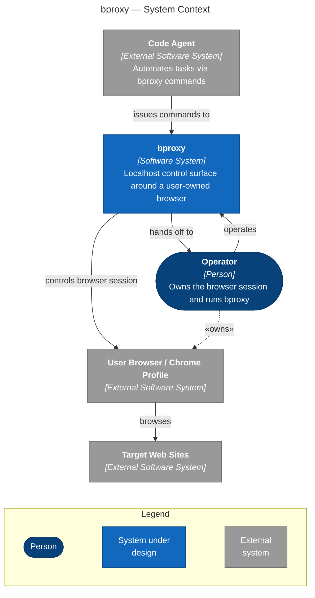

This page shows where bproxy sits in its surroundings. The diagram draws the system as a single box and surrounds it with the people who use it and the other systems it talks to. How bproxy works on the inside — the parts it is built from, the technologies, the run-time setup — belongs to the other pages linked at the bottom.

Figure 1. System context for bproxy — the people and external systems that interact with the tool, and the broad nature of each relationship. Dashed edges denote static ownership rather than active interaction.

## What this picture tells you

bproxy is not a browser of its own. It runs on the operator's machine and drives an existing Chrome session. The code agent never touches a web page directly — every action goes through bproxy, which translates it into work inside the real browser. The agent's window into the web is always the operator's browser, never a separate automated context.

The operator owns everything on the browser side: the Chrome profile, the cookies, the saved logins, the browser fingerprint. They also stay in the loop while bproxy runs — starting the service, pairing the extension when it first connects, and stepping in whenever bproxy asks for human help. Ownership and supervision are part of the design, not hidden behind automation.

## See also

- [Containers](./02-containers.md) — the runtime processes inside bproxy.
- [Deployment](./03-deployment.md) — where those processes run and which trust boundaries separate them.
- [Threat model](./06-threat-model.md) — the security consequences of those boundaries.
