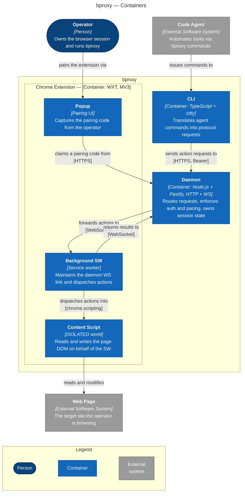

This page zooms one level inside bproxy and shows the three runtime processes it is built from — where each one runs and how they talk to each other. The diagram is the canonical bproxy picture: every later view either drills into one of the boxes (a component view) or follows a slice of behaviour that crosses them (a sequence or state view). How bproxy uses these pieces in concrete scenarios, and the trust boundaries between them, belong to the other pages linked at the bottom.

Figure 2. Container view of bproxy — the three runtime processes (CLI, Daemon, Chrome Extension) inside the bproxy boundary and how they communicate with the agent, the operator, and the target page.

## What this picture tells you

bproxy is three processes that live in three different places. The CLI sits in the agent's shell — a stable, one-shot command surface that any code agent can call. The Daemon runs on the operator's machine as a long-running localhost service that routes requests, enforces authentication and pacing, and owns session state. The Chrome Extension lives inside the browser itself; it is the only piece of bproxy that can actually drive a Chrome session.

This split is not arbitrary — each capability is locked to a particular runtime. Only an extension can touch the operator's browser. But Chrome can suspend an MV3 service worker at any moment, so the extension cannot be where agent commands arrive; it would miss them. The Daemon bridges the two sides: it is always running, holds the queue of pending requests, and reconciles service-worker restarts by replaying outstanding work over a persistent WebSocket.

The agent's view of the web is always indirect. The Content Script is the only piece that ever touches a page's DOM, and it does so inside the operator's real Chrome profile — there is no headless browser, no automated context, no separate identity. Two separate authentication tokens protect the two daemon-facing routes: one for any HTTP client (the CLI, or another agent-side tool), and a second for the extension's WebSocket link. Pairing the extension is an operator action through the popup — the CLI cannot pair the extension on the agent's behalf.

## See also

- [Context](./01-context.md) — what bproxy is from the outside, the people and external systems it interacts with.
- [Deployment](./03-deployment.md) — where these processes run on the operator's machine and which trust boundaries separate them.
- [Session state](./04-session-state.md) — the state machine the daemon uses to gate every forwarded action.
- [Threat model](./06-threat-model.md) — DFD and STRIDE notes for these containers and the wires between them.

To drill inside any container, click its node in the diagram above; the auto-generated component graphs live under [`views/auto/`](./auto/) and are refreshed by `pnpm views:regen`.
