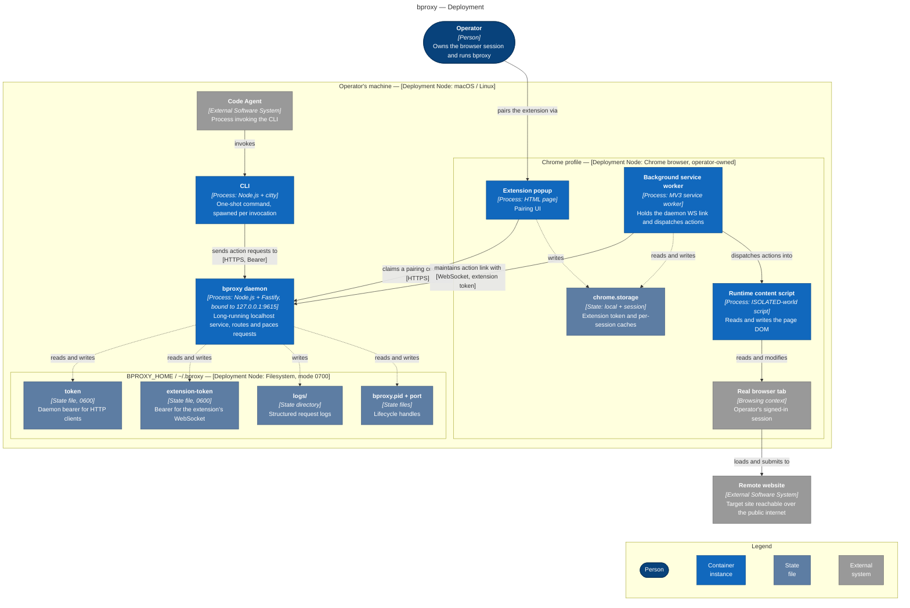

This page shows where each piece of bproxy actually runs — what machine hosts it, what process boundary contains it, and what files it persists on disk. The arrows show what crosses each boundary and over what wire, but not the sequence of events on those wires; behaviour, internal component structure, and concrete scenarios live in the other pages linked at the bottom.

Figure 3. Deployment view of bproxy — where each runtime process lives on the operator's machine, what state the daemon and the extension own, and how the agent and the operator reach the system from outside the boundary.

## What this picture tells you

Every bproxy runtime piece lives on the operator's own machine. The CLI is short-lived — spawned per invocation, gone after a single command. The daemon is a long-running localhost service whose network surface is bound to `127.0.0.1` by design, not a LAN address and not an internet endpoint. The Chrome extension runs inside the operator's existing Chrome profile, not in a separate automation browser. The whole control plane stops at the machine boundary.

State is split into two domains, each tied to the process that owns it. The daemon writes its bearer tokens, lifecycle handles, and structured logs under `BPROXY_HOME` (defaulting to `~/.bproxy`), with the directory and the credential files locked down to the operator. The extension keeps its bootstrap token and per-session caches in `chrome.storage`, scoped to the Chrome profile. Neither side reads the other's domain — the only thing they share is the authenticated WebSocket between the daemon and the background service worker.

Only the browser tab reaches the public internet, and it does so as the operator's regular browsing traffic. The CLI never makes outbound calls; neither does the daemon. The content script reads and writes the page's DOM but does not initiate network requests outside the page's own context. From a remote server's point of view, every request looks like the operator browsing normally — same cookies, same identity, same fingerprint.

## See also

- [Context](./01-context.md) — bproxy seen from the outside, the people and external systems it interacts with.
- [Containers](./02-containers.md) — the same processes from a logical perspective: their responsibilities and the protocols between them.
- [Session state](./04-session-state.md) — the behaviour the daemon imposes on every forwarded action.
- [Threat model](./06-threat-model.md) — the security properties of these placements and the wires between them.

For normative implementation details on the daemon and the extension, see [Proxy Daemon](../solution/service.md) and [Browser Extension](../solution/extension.md).
