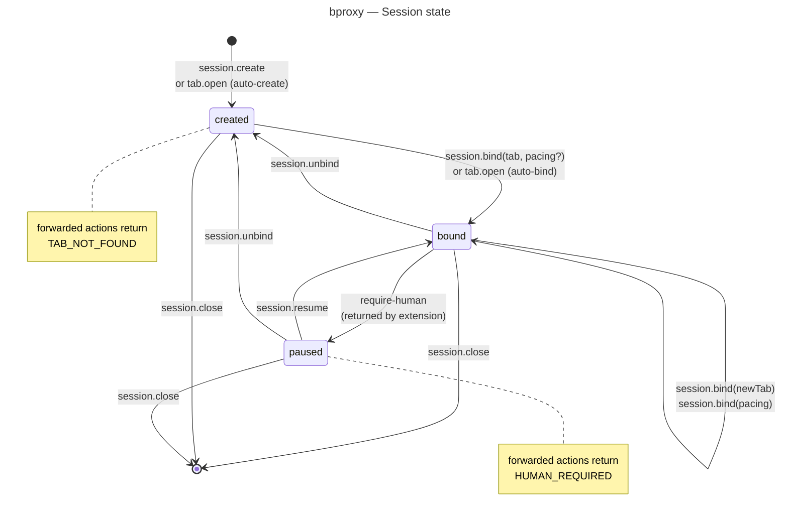

This page describes what a session does inside the daemon over time — the four states it can occupy and which actions move it from one to the next. How the daemon fits among the other runtime processes, and the security gates that protect each transition, live in the other pages linked at the bottom.

Figure 4. State machine the daemon maintains for each session — the four states a session can occupy and the actions that transition between them.

## What this picture tells you

The daemon is the only place this state lives. Nothing on the CLI side carries a "session is bound" flag — an agent cannot fabricate a bound session by sending different headers. Every transition above is a daemon-side mutation, and every session is forgotten when the daemon stops. Restarting the service clears all sessions; only the extension token survives across restarts.

Sessions are created **explicitly** — either via `session.create` (returns a fresh `SessionId`) or as a side-effect of `tab open --url ...` when `-s` is omitted (which auto-creates a session, opens a tab, and binds them together). Session ids are daemon-generated 6-character base32 strings matching `/^[a-z2-7]{6}$/`; agents cannot choose or reuse them.

`session.bind --tab tN` moves the session to `bound` by resolving a logical `TabHandle` (like `t1`) to the internal Chrome tab id. Only tabs registered to the same session can be bound. Calling `session.bind` again with a different tab (or just a new pacing setting) is the self-loop on `bound`: the very next forwarded action picks up the new target.

The session moves to `paused` when the extension reports that the page needs human help — for example, a CAPTCHA or a login wall — and the daemon refuses every forwarded action in that state with `HUMAN_REQUIRED`, so the agent stops looping into an unresponsive page. Daemon-local actions still work: the operator can run `session.*` or `debug.last` to inspect, or rebind to another tab. Either `session.resume` (back to `bound`) or `session.unbind` (back to `created`, also clearing pause) leaves the state.

`session.close` is a terminal transition from any state. It closes all Chrome tabs owned by the session (forwarding `tab.close` for each one), then destroys the session. The closed session id cannot be reused.

## Logical tab handles

Tabs within a session are referenced by logical handles like `t1`, `t2`, etc. (`TabHandle` branded type). These are session-scoped: `t1` in session `m4q7z2` is a different tab than `t1` in session `p7k2qm`. Raw Chrome tab ids never appear in CLI output, protocol responses, or `debug.status`/`debug.last` data — they exist only in daemon-internal state and operator-level daemon logs.

Element handles (`el1`, `ln3`, ...) are separate from session state. They are daemon-cache aliases scoped to one `{session, tab, page}` snapshot, not durable capabilities like the session id or logical tab handle. Navigation, explicit tab close, and session close invalidate them; a fresh read of the same scope replaces the previous batch.

## See also

- [Containers](./02-containers.md) — where the daemon sits relative to the CLI and the extension.
- [Threat model](./06-threat-model.md) — the auth gate that protects every transition above.

For normative implementation details, see [Proxy Daemon](../solution/service.md#action-routing-and-session-contract) — *Action Routing and Session Contract*.
