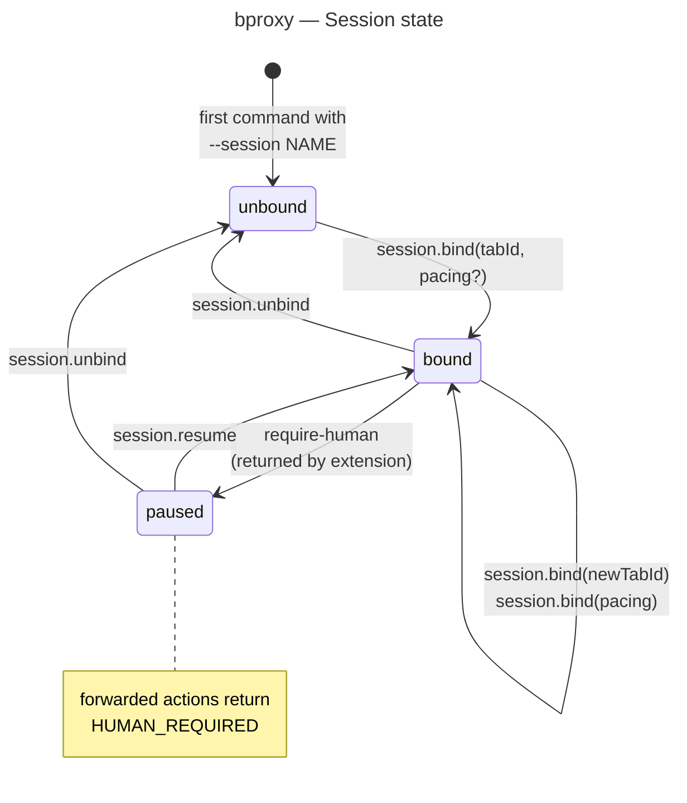

This page describes what a session does inside the daemon over time — the three states it can occupy and which action moves it from one to the next. How the daemon fits among the other runtime processes, and the security gates that protect each transition, live in the other pages linked at the bottom.

Figure 4. State machine the daemon maintains for each session — the three states a session can occupy and the actions that transition between them.

## What this picture tells you

The daemon is the only place this state lives. Nothing on the CLI side carries a "session is bound" flag — an agent cannot fabricate a bound session by sending different headers. Every transition above is a daemon-side mutation, and every session is forgotten when the daemon stops. Restarting the service clears all sessions; only the daemon's bearer token survives across restarts.

A session starts in `unbound` as soon as any command first references a `--session NAME` — there is no separate "create session" call. `session.bind(tabId)` moves it to `bound` and tells the daemon which browser tab to forward subsequent actions into. Calling `session.bind` again with a different tab id (or just a new pacing setting) is the self-loop on `bound`: the very next forwarded action picks up the new target.

The session moves to `paused` when the extension reports that the page needs human help — for example, a CAPTCHA or a login wall — and the daemon refuses every forwarded action in that state with `HUMAN_REQUIRED`, so the agent stops looping into an unresponsive page. Daemon-local actions still work: the operator can run `session.*` or `debug.last` to inspect, or rebind to another tab. Either `session.resume` (back to `bound`) or `session.unbind` (back to `unbound`, also clearing pause) leaves the state.

## See also

- [Containers](./02-containers.md) — where the daemon sits relative to the CLI and the extension.
- [Threat model](./06-threat-model.md) — the auth gate that protects every transition above.

For normative implementation details, see [Proxy Daemon](../solution/service.md#action-routing-and-session-contract) — *Action Routing and Session Contract*.
