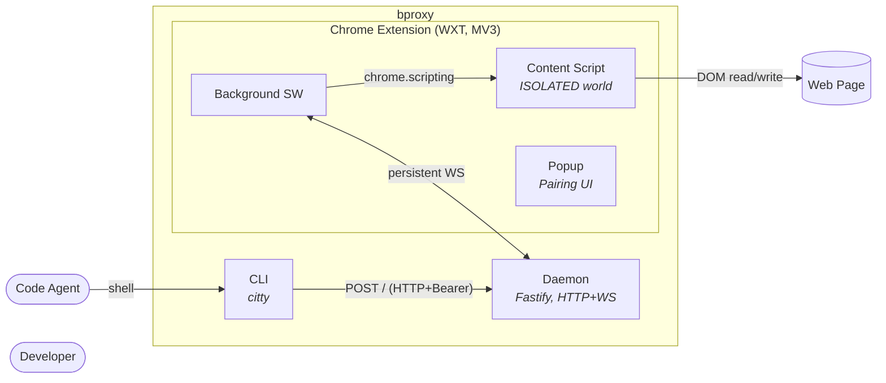

Implementation spec for the visual architecture artifact and its rendering wrapper. A small static site built with [Astro Starlight](https://starlight.astro.build) renders a curated set of [Mermaid](https://mermaid.js.org) diagrams plus the existing prose docs. Two helper scripts keep the artifact discoverable when code or decisions change.

**Decisions that constrain this:** [ADR-005](../decisions.md#adr-005-typescript-as-project-language) (TypeScript), [ADR-009](../decisions.md#adr-009-observability-as-a-first-class-design-constraint) (every artifact independently inspectable), [ADR-012](../decisions.md#adr-012-static-analysis-stack) (dep-cruiser already in the stack — reused for auto-derived component graphs), [ADR-019](../decisions.md#adr-019-architecture-views-toolchain--astro-starlight--mermaid--advisory-sync-helpers) (toolchain), [ADR-020](../decisions.md#adr-020-architecture-views-layering--c4-spine-with-diátaxis-ia) (layering).

## Documentation tiers

`docs/` is split into two sibling tiers:

- **`docs/public/`** — rendered by this site. Read by bproxy users and by developers wanting the big-picture overview. Layered C4 narrative, plain prose, no project-side jargon.
- **`docs/internal/`** — project artifacts. Read by bproxy developers only. ADRs, plans, journal, architecture detail, scenarios, quality gates, and this spec. Internal cross-links between artifacts are preserved verbatim.

The Astro site reads only `docs/public/`. The filesystem boundary, not a sidebar filter, enforces the split. Rules:

- **No cross-tier links in rendered pages.** A public page must not link to an internal-tier file; the link would bounce readers into project-only documentation.
- **No cross-tier coupling in public source files.** Public-tier frontmatter does not reference internal-tier identifiers or paths — no `relatedAdrs:` listing ADR numbers, no `sources:` entries pointing into `docs/internal/`.
- **Internal → public links are fine.** This spec lives in `docs/internal/solution/views.md` and freely references the public surfaces it shapes.
- **Internal → internal links unchanged.** ADRs, plans, journal, and quality-gates retain their existing cross-references.

Background and rationale: [`journal/2026-05-24-docs-publication-split.md`](../journal/2026-05-24-docs-publication-split.md).

## Purpose

The artifact exists to:

1. Provide a **layered perception** of bproxy: System Context → Containers → Components → Code, traversable in order.
2. Be **presentable** — open the local site, project the screen, walk a viewer through the system without scrolling past unrelated prose.
3. Be an **onboarding entry point** — one navigable path that lands a new contributor on the right page in five minutes.
4. Stay **discoverable when code or decisions evolve** — helper scripts surface the views whose declared sources changed in a branch, so the author updates the right ones before merging.

The site is a wrapper around the public tier. The published surface is the curated views, the solution specs, and the landing page (`index.md`). The internal narrative sources — `architecture.md`, `decisions.md`, `scenarios.md` — stay in `docs/internal/` and are not rendered. Authors of public pages draw on the internal sources but write standalone explanation for the public reader.

## Project Layout

```
views/                              # Astro Starlight workspace (TS)
├── package.json                    # deps: astro, @astrojs/starlight, zod
├── astro.config.mjs                # Starlight config; content sourced from ../docs/public/
├── tsconfig.json
├── src/
│   ├── content.config.ts           # Astro content collections (docs + views)
│   ├── lib/
│   │   └── view-schema.ts          # Zod schema for view frontmatter (load-bearing; imports raw `zod`)
│   ├── components/                 # Starlight overrides (page frame, etc.)
│   └── styles/                     # minimal theme tweaks
└── scripts/
    ├── audit.ts                    # `pnpm views:audit` — drift detection
    └── regen.ts                    # `pnpm views:regen` — component-graph regeneration

docs/
├── public/                         # rendered by the site
│   ├── index.md                    # landing — motivation, use cases, design principles
│   ├── views/                      # curated views (C4 + behaviour + threat)
│   │   ├── 01-context.md
│   │   ├── 02-containers.md
│   │   ├── 03-deployment.md
│   │   ├── 04-session-state.md
│   │   ├── 06-threat-model.md
│   │   └── auto/                   # generated SVGs (component graphs)
│   │       ├── daemon-components.svg
│   │       ├── extension-components.svg
│   │       └── cli-components.svg
│   └── solution/                   # implementation specs (reference tier)
│       ├── cli.md
│       ├── service.md
│       ├── extension.md
│       └── shared.md
└── internal/                       # project artifacts (not rendered)
    ├── architecture.md
    ├── decisions.md                # ADRs
    ├── scenarios.md
    ├── quality-gates.md
    ├── plans/
    ├── journal/
    └── solution/
        └── views.md                # this file
```

The Astro app reads `../docs/public/`. Files under `docs/internal/` are project artifacts and not part of the rendered site.

## Diagram Set

The artifact maintains **five curated diagrams** plus an auto-derived component layer. The ceiling is intentional — if a candidate sixth diagram duplicates prose, the prose stays and the diagram is dropped. (A round-trip scenario sequence diagram occupied slot 05 in an earlier scope; it was dropped during the publication split and may return later as a separate appendix if it earns its keep.)

| # | File | Diagram | Notation | Source-of-truth |
|---|---|---|---|---|
| 01 | `docs/public/views/01-context.md` | C4 System Context | Mermaid `flowchart` | Intent (hand-edited) |
| 02 | `docs/public/views/02-containers.md` | C4 Container view | Mermaid `flowchart` w/ subgraphs | Intent (hand-edited) |
| 03 | `docs/public/views/03-deployment.md` | C4 Deployment | Mermaid `flowchart` w/ subgraphs | Intent (hand-edited) |
| 04 | `docs/public/views/04-session-state.md` | Daemon session state | Mermaid `stateDiagram-v2` | Intent (hand-edited) |
| 06 | `docs/public/views/06-threat-model.md` | DFD + STRIDE annotations | Mermaid `flowchart` w/ trust-boundary subgraph | Intent (hand-edited) |
| — | `docs/public/views/auto/*.svg` | Per-workspace component dep graphs | SVG from `dependency-cruiser` | Code (regenerated) |

Numbering preserves historical slot order; slot 05 is intentionally absent.

The Container diagram (02) is the canonical artifact. Most navigation flows through it: its nodes are clickable and drill into the auto-derived component graphs.

## Layering Model

C4 as the spine, populated for bproxy:

- **C1 (Context)** — Code Agent, Developer, bproxy, Web Page
- **C2 (Containers)** — CLI, Daemon, Extension (with Background SW, Content Script, Popup as nested boundary)
- **C3 (Components)** — Daemon internals (auth, pacing, ws-hub, pending-map, sessions), Extension internals (tab-router, frame-table, dispatch, read primitives, write methods)
- **C4 (Code)** — file-level dependency graphs per workspace, generated, not hand-drawn

Cross-cutting indexes (not layers): Protocol envelope, Actions catalog, ADRs, and Scenarios all live in `docs/internal/`. They inform the public views without being rendered. Public-tier rationale is named in view prose; the internal sources are the maintainer's reference.

Diátaxis applied to the public-tier IA:
- `docs/public/views/` + `docs/public/index.md` → **explanation**
- `docs/public/solution/*.md` → **reference**
- _(how-to)_ — `index.md`'s use-cases section gestures at it; deferred until concrete walkthroughs exist
- _(tutorial)_ — deferred until the daemon exists and a first end-to-end walkthrough is real

## Content Collection Schema

The frontmatter of each view file is **load-bearing**. Two consumers read it:
1. Starlight at build time (validates, generates sidebar, renders ADR footer)
2. `views:audit` at lint time (compares declared `sources` to the diff)

A single Zod schema covers both. To make it importable from a plain Node script (the audit CLI), it lives in its own file that imports `zod` directly — not from `astro:content`, which only resolves inside an Astro build.

```typescript
// views/src/lib/view-schema.ts
import { z } from 'zod';

export const viewSchema = z.object({
  layer: z.enum(['c1', 'c2', 'c3', 'c4', 'behavior', 'threat']),
  sources: z.array(z.string()).min(1),  // code globs vs repo root; must not point into docs/internal/
  related: z.array(z.string()).optional(),  // sibling view slugs
});

export type View = z.infer<typeof viewSchema>;
```

The Astro content config imports the same schema:

```typescript
// views/src/content.config.ts
import { defineCollection } from 'astro:content';
import { glob } from 'astro/loaders';
import { docsSchema } from '@astrojs/starlight/schema';
import { viewSchema } from './lib/view-schema';

export const collections = {
  docs: defineCollection({
    loader: glob({ pattern: ['**/*.{md,mdx}', '!views/**'], base: '../docs/public' }),
    schema: docsSchema(),
  }),
  views: defineCollection({
    loader: glob({ pattern: '**/*.md', base: '../docs/public/views' }),
    schema: docsSchema({ extend: viewSchema }),
  }),
};
```

Example frontmatter (`docs/public/views/02-containers.md`):

```markdown
---
title: Containers
layer: c2
sources:
  - shared/protocol/**
  - service/src/**
  - extension/src/**
  - cli/src/**
related: [01-context, 03-deployment]
---
```

Build fails on malformed frontmatter — typos like `sourcse:` are caught before merge.

## Diagram Conventions

### Mermaid in fenced blocks

Diagrams live as ```` ```mermaid ```` fenced blocks inside the view's markdown file. An inline remark plugin (12 lines, zero new deps) converts them to `<pre class="mermaid">` blocks at build time; Mermaid's CDN ESM bundle renders them client-side at runtime. Source stays in the file — agents reading raw markdown see the diagram source, not just rendered output.

`rehype-mermaid` was evaluated and rejected: it carries `mermaid-isomorphic` as a hard dependency, which in turn lists `playwright` as a peer dependency unconditionally — even for strategies that never invoke Playwright. Playwright is not permitted in this project.

### Use `flowchart`, not `C4Container`

Mermaid's `C4Container` family is marked experimental and renders inconsistently. Use `flowchart` with named subgraphs to express the same Container shape; the C4 vocabulary lives in node labels and arrow captions, not in syntax.

Example (Container view):



### Native drill-down via `click`

Mermaid's `click NodeID "url" "tooltip"` syntax makes diagram nodes navigable. Container nodes link to their component sub-graphs in `docs/views/auto/`. No custom code; no glue.

## Writing a View Page

Rules distilled from rework. Each view page follows the same rhythm:

1. **Lead paragraph** above the diagram. One short paragraph in plain English. Names what the page shows and what it deliberately doesn't; points further questions to the linked pages at the bottom. No bold.
2. **Self-contained diagram.** Title in the Mermaid `---title---` frontmatter; legend subgraph at the bottom; colour and shape encoding consistent with the legend. The SVG must still make sense if extracted on its own.
3. **Numbered figure caption** immediately beneath the diagram, in regular-weight prose. Form: `Figure N. [what the figure shows] — [notation note if any].` This is what a reader (human or agent) gets without rendering the diagram.
4. **Closing paragraphs** naming what the reader should walk away with. Connected thoughts read as paragraphs, not bullets. Emphasis comes from being the first sentence of a paragraph, not from typography.

Editorial style:

- **Audience first.** Readers can follow diagrams logically but are not fluent in C4 vocabulary. Avoid notation jargon (`stereotype`, `system under design`, `discriminated union`) in prose; let the diagram carry the notation and let the prose translate it.
- **Decisions are named in prose, not linked.** Where a view depends on a project-side decision that shapes its content, name the principle in plain English (*"the extension is a thin sensor+actuator, exposing capabilities but not strategizing"*) rather than referencing an ADR identifier. The public reader has no internal context; ADR numbers are jargon. The ADR ledger remains in `docs/internal/decisions.md` for developer trace.
- **No links into `docs/internal/`.** Public pages stand alone. If a decision deserves more depth than the prose carries, expand the prose; do not bounce the reader to an artifact. Pointers from `index.md` to the repository on GitHub for readers who want the audit trail are the documented exception.
- **One emphasis device per element.** Bold or italic, never both. Do not bold the first words of every bullet — alternating weight reads as a zebra, not as emphasis.
- **Edges describe purpose, not protocol.** Labels say what the relationship is for (*controls browser session*), not how it is implemented (*via localhost daemon + extension*). Implementation belongs to the next layer.
- **Each layer answers its own question and defers the others.** Internal structure, technology choices, deployment, and security consequences each have their own page; do not borrow content from the next layer down to "complete" the picture.
- **Cross-page links use the target's title, not its file slug.** Write `[Containers](./02-containers.md)`, not `[02-containers](./02-containers.md)`. The slug is a filesystem detail; the reader sees the title in the sidebar, breadcrumbs, and browser tab, and the link text must match.

## Sync Helpers

Two CLI scripts exposed as workspace tasks. Both advisory — neither fails CI.

### `pnpm views:audit`

**File:** `views/scripts/audit.ts`

Given a diff (default: `git diff --name-only origin/main...HEAD`), reports which views' declared `sources` were touched and whether the view file itself was touched in the same branch.

```
$ pnpm views:audit

Changed files in this branch:
  shared/protocol/envelope.ts
  service/src/auth.ts
  service/src/pacing.ts

Views potentially affected:
  ⚠ 02-containers     touched-sources: 2  view-touched: no
                       sources match: service/src/**
                       → consider reviewing for accuracy

  ⚠ 04-session-state  touched-sources: 1  view-touched: no
                       sources match: service/src/auth.ts (via service/src/**)
                       → consider reviewing for accuracy

  ✓ 03-deployment     touched-sources: 0  view-touched: no
  ✓ 06-threat-model   touched-sources: 1  view-touched: yes

Hint: run `pnpm views:regen` if any component graph under docs/views/auto/ is stale.
```

The audit imports `viewSchema` from `views/src/lib/view-schema.ts` and validates every parsed frontmatter through `safeParse`. Parse failures surface in the report with the offending file path and Zod field path (e.g., `02-containers.md: sources — Required`); the audit still exits 0 (advisory contract preserved), but malformed frontmatter shows up loudly instead of silently passing.

Frontmatter is parsed with `js-yaml`, not a hand-rolled extractor — single source of truth requires a real YAML reader.

Glob matching: minimatch against repo-relative paths.

### `pnpm views:regen`

**File:** `views/scripts/regen.ts`

Runs `dependency-cruiser` per workspace (`cli`, `service`, `extension`) and emits SVG into `docs/views/auto/`. Configurable depth and clustering via `dependency-cruiser`'s standard options; defaults are tuned to component-level granularity (single-file leaves, package boundaries as clusters).

```
$ pnpm views:regen

Regenerating component graphs:
  cli         → docs/public/views/auto/cli-components.svg          (12 modules)
  service     → docs/public/views/auto/service-components.svg      (28 modules)
  extension   → docs/public/views/auto/extension-components.svg    (19 modules)

Done. Commit the SVGs if they changed.
```

Idempotent. Designed to be run before commit, not by CI.

## Interactivity

Stock Starlight features plus Mermaid native — no custom widgets in v1.

| Mechanism | Provided by | Behavior |
|---|---|---|
| Sidebar navigation | Starlight | Auto-generated from content collection, ordered by filename prefix (`01-`, `02-`, …). The sidebar **is** the layer ladder. |
| Clickable diagram nodes | Mermaid `click` syntax | Container nodes link to their component sub-graphs under `auto/`. No cross-tier links from diagrams. |
| Breadcrumbs | Starlight built-in | Shows layer path at top of each view. |
| Prev / next | Starlight built-in | Footer arrows traverse the sidebar order. |

Not in v1: pan/zoom on diagrams, fullscreen overlay, search-within-diagram, per-view dark/light theming overrides. All add weight; none required by the goals.

## Deployment

| Stage | Command | Surface |
|---|---|---|
| Development | `pnpm docs:dev` | Starlight dev server on `localhost:4321`. Hot-reloads on edits to `docs/**` and `views/src/**`. |
| Build | `pnpm docs:build` | Static `views/dist/` directory. |
| CI | `pnpm docs:build` runs on every PR | Catches frontmatter schema violations and broken intra-site links. Mermaid rendering issues are surfaced in local `docs:dev` / preview runtime checks. Does **not** publish. |
| Public hosting | _(deferred)_ | When bproxy goes public, add a GitHub Pages workflow that publishes `views/dist/` on merge to `main`. No decision required now. |

## Failure Modes

| Failure | Surface |
|---|---|
| Mermaid syntax error in a view | Page renders with Mermaid runtime error in `docs:dev` / preview. CI build may still pass in `pre-mermaid` mode. |
| Malformed view frontmatter (missing field, wrong type) | Build fails via Zod with field path. |
| Public-tier file references `docs/internal/*` (rendered link, frontmatter `sources:` entry) | _(not enforced in v1)_ — caught in review. A future audit-rule extension could flag this automatically. |
| `views:audit` reports nothing changed but author knows otherwise | The `sources` glob is wrong. Update the frontmatter — that's the maintenance loop. |
| Auto-generated component graph differs from committed SVG | _(not enforced in v1)_ — the user runs `views:regen` and commits the result. |

## Testing

Light. The artifact is content, not behavior.

- **Schema tests** (`vitest`): construct view frontmatter fixtures, verify Zod accepts/rejects.
- **Audit tests** (`vitest`): given fake diffs and fake view frontmatter, verify the audit identifies the right affected views.
- **Regen smoke test**: run `views:regen` in CI, verify it exits 0 and writes the expected files. SVG content is not snapshot-tested (layout is noisy).

No tests on Starlight itself — it's an upstream dependency.

## Development

```bash
cd views
pnpm dev          # alias for `pnpm docs:dev` — Starlight on localhost:4321
pnpm build        # alias for `pnpm docs:build`
pnpm audit        # alias for `pnpm views:audit`
pnpm regen        # alias for `pnpm views:regen`
pnpm test         # vitest on schema + audit logic
```

## Out of Scope (v1)

- Live/runtime introspection of the daemon or extension. The artifact is design-time documentation; observability of the running system is covered by `debug.*` actions (see [service.md](../../public/solution/service.md) and [architecture.md](../architecture.md)).
- Likec4, Structurizr, or any DSL-driven multi-view system. Considered and rejected: a single-source-of-truth DSL fights the "render markdown" framing; Likec4's static export goes through headless Chromium with Playwright (no native vector renderer), and its embed path requires React + PandaCSS as peer dependencies. The MCP-queryable benefit is mostly achievable by parsing Mermaid sources or a small manifest, without inheriting the toolchain.
- Visual editing inside the browser. The artifact is git-versioned text.
- Auto-generation of intent diagrams (Context / Container / Deployment / Session State / Threat Model). These encode decisions, not code shape.
- Public hosting. The site builds in CI as a correctness gate; deployment is deferred.

## Related

- [architecture.md](../architecture.md) — system shape and protocol (internal artifact; informs public-tier prose)
- [decisions.md](../decisions.md) — ADRs (internal artifact)
- [scenarios.md](../scenarios.md) — driving use cases (internal artifact; informs `index.md`'s use-cases section)
- [solution/cli.md](../../public/solution/cli.md), [solution/service.md](../../public/solution/service.md), [solution/extension.md](../../public/solution/extension.md), [solution/shared.md](../../public/solution/shared.md) — sibling component specs (published)
- [quality-gates.md](../quality-gates.md) — defines `pnpm check`; the views audit/regen scripts are independent of it (advisory, not blocking)
- [journal/2026-05-24-docs-publication-split.md](../journal/2026-05-24-docs-publication-split.md) — rationale for the public/internal tier split
