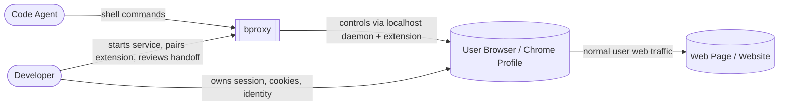

The system boundary around bproxy. This view answers one question only: **who interacts with bproxy, and through what broad relationship?**

## What this picture tells you

- **bproxy is not a browser.** It is a control surface around a real user browser session.
- **The browser stays user-owned.** Cookies, login state, extensions, and fingerprint all remain in the developer's real Chrome profile rather than a Playwright-style automated context.
- **The agent interacts indirectly.** The code agent never talks to websites itself; it issues CLI commands into bproxy, which relays them through the daemon and extension.
- **The user remains in the loop.** Pairing, browser setup, and `HUMAN_REQUIRED` handoff are explicit user touchpoints rather than hidden automation.

## See also

- [02-containers](./02-containers.md) — the runtime processes inside bproxy.
- [03-deployment](./03-deployment.md) — where those processes run and which trust boundaries separate them.
- [06-threat-model](./06-threat-model.md) — the security consequences of those boundaries.
