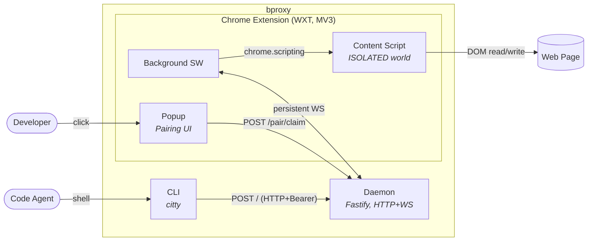

The three runtime processes and how they communicate. This is the canonical bproxy diagram — every later view either zooms into one of the boxes below (Component-level) or describes a slice of behaviour that crosses them (Sequence, State).

## What this picture tells you

- **Three processes, four protocols.** The CLI talks HTTP to the Daemon. The Daemon talks WebSocket to the Extension's Background SW. The SW dispatches into Content Scripts via `chrome.scripting`. The Content Script reads and writes the page via the DOM. Two distinct authentication tokens secure the two daemon-facing routes ([ADR-010](../decisions.md#adr-010-websocket-auth-transport--two-token-model)).
- **The agent never sees the page.** Only the Content Script touches the DOM, in the page's ISOLATED world. MAIN-world execution is on-demand and one-shot ([ADR-013](../decisions.md#adr-013-main-world-runtime-api-writes)).
- **The user is a participant.** Pairing is popup-driven ([ADR-011](../decisions.md#adr-011-extension-token-bootstrap-via-popup-driven-pairing)) — the CLI doesn't talk directly to the extension.

## See also

- Inside the Daemon: [auto/service-components.svg](../auto/service-components.svg) — generated by `pnpm views:regen`.
- How the daemon decides what to do with each command: [04-session-state](./04-session-state.md) — the FSM that gates every forwarded action.
- What protects the wire and the token files: [06-threat-model](./06-threat-model.md) — DFD + STRIDE for the Phase 2 surface.
- Inside the Extension: _Component view, coming in Phase 3._
- Trust boundaries and where each process runs: _Deployment view, coming in a later phase._
