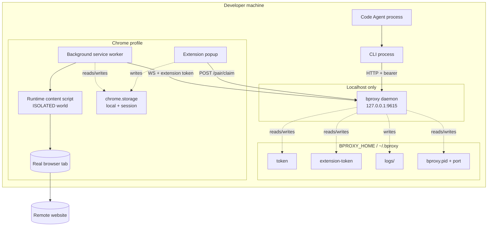

Where the bproxy runtime pieces actually live. This view focuses on **machine/process placement and trust boundaries**, not action routing.

## What this picture tells you

- **Everything control-plane stays local.** CLI, daemon, extension, token files, and extension storage all live on the developer's machine.
- **The daemon is loopback-only.** Its network surface is intentionally `127.0.0.1`, not a LAN or internet-exposed service.
- **Browser execution happens inside the real profile.** The extension acts inside Chrome rather than driving a separate automation browser.
- **Two persistence domains exist.** Daemon credentials/state files live under `BPROXY_HOME`; extension bootstrap and caches live in Chrome storage.
- **Only the browser tab talks to the remote site.** Control traffic is local; normal web traffic leaves the machine through the user's browser session.

## See also

- [02-containers](./02-containers.md) — logical runtime responsibilities and protocols.
- [06-threat-model](./06-threat-model.md) — the security properties of the same boundaries.
- [solution/service.md](../solution/service.md) and [solution/extension.md](../solution/extension.md) — normative runtime details.
