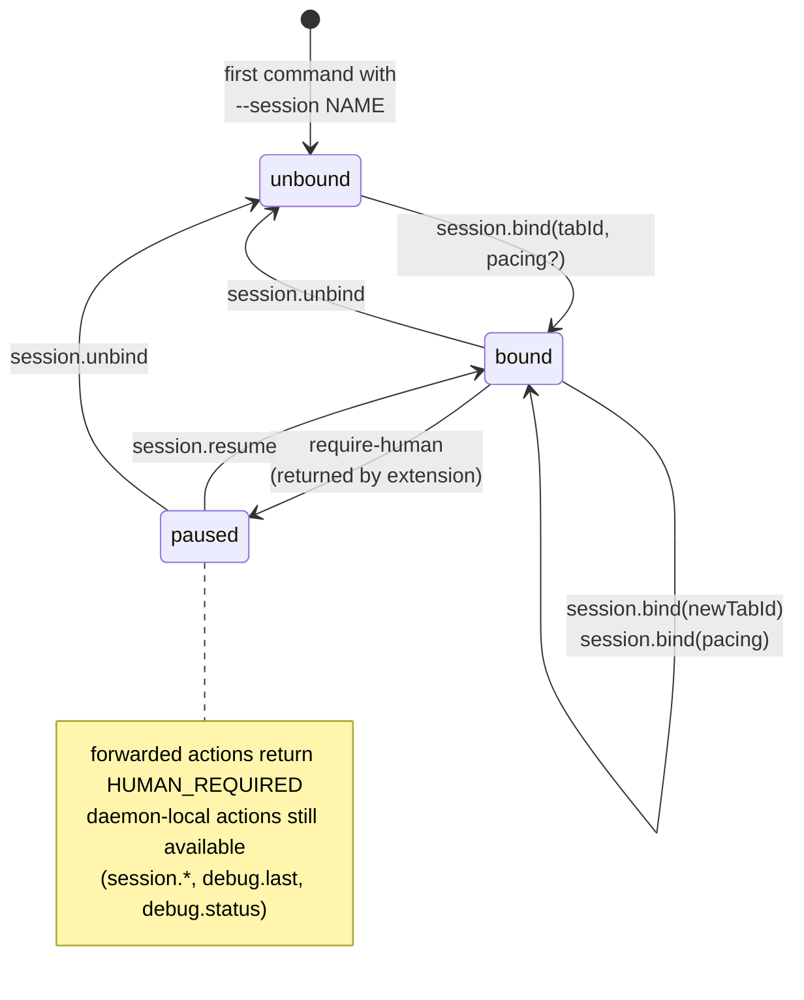

How a session moves between *unbound*, *bound* and *paused*, and which action causes each transition. The daemon is the source of truth for this state ([service spec § Session authority](../solution/service.md#action-routing-and-session-contract)); state lives in memory only and resets on daemon restart.

## What this picture tells you

- **The daemon owns the FSM.** No state is kept on the CLI side; agents cannot fabricate a "bound" session by sending different headers. Every observable transition above corresponds to a daemon-side mutation in `sessions.ts`.
- **`session.bind` is the chicken-and-egg unblocker.** It works from `unbound` — sessions don't have to be created any other way first. This is asserted by the Gap A contract test *"session.bind works from unbound session and updates pacing"* and by the Gap B workflow *"unbound session → session.bind → forwarded action"*.
- **Pause is sticky and exit-only via `session.resume`.** A paused session refuses every forwarded action (`HUMAN_REQUIRED`); daemon-local actions (`session.*`, `debug.last`, `debug.status`) remain available so an operator can introspect or rebind without resuming. `session.unbind` is allowed from `paused` too — it both clears the tab and (per `sessions.ts`) drops the pause flag.
- **Rebinding is immediate.** Calling `session.bind` again with a different `tabId` (or just a new `pacing`) is a self-loop in the bound state — the very next forwarded command picks up the new target. Gap B workflow *"tab reassignment updates routing target"* anchors this.
- **Restart resets everything.** Session state is in-memory by design ([service spec § Session authority](../solution/service.md#action-routing-and-session-contract)). After `bproxy-service stop && start`, all sessions are gone; the daemon does not persist them. The daemon bearer token *is* persisted (file mode `0600`, owner-checked); session state is not. See [06-threat-model](./06-threat-model.md) for the file-mode invariants.

## See also

- [02-containers](./02-containers.md) — where the daemon sits relative to the CLI and extension.
- [06-threat-model](./06-threat-model.md) — the auth gate that protects every transition above.
- [service spec § Action Routing and Session Contract](../solution/service.md#action-routing-and-session-contract) — normative source.
