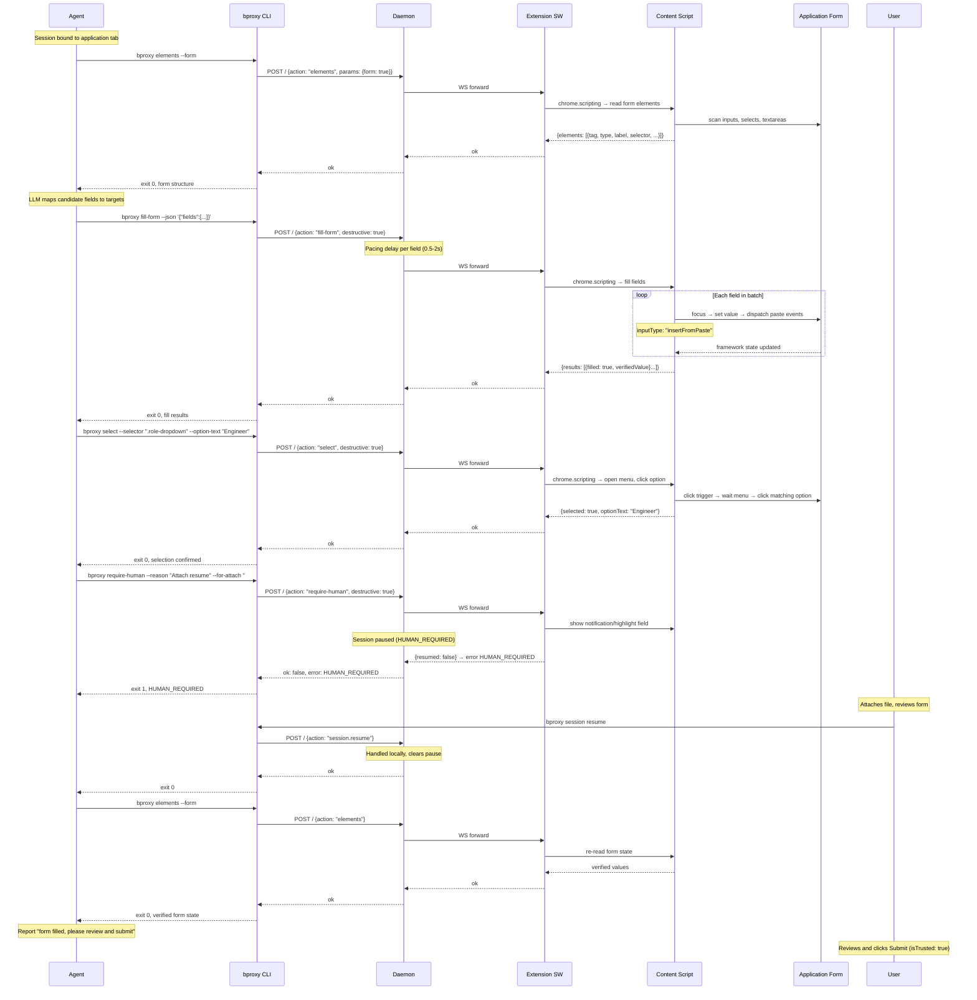

Sequence view for [Scenario 3 — Job application form fill](../../scenarios.md#scenario-3--job-application-form-fill). The agent reads form structure, fills fields with explicit method/world, handles custom dropdowns, and hands off file uploads to the human. The user submits.

## Key observations

- **Paste, not typing** — `fill-form` uses `inputType: "insertFromPaste"` events. No keystroke cadence to fingerprint.
- **Explicit method/world** — the CLI requires `method` and `world` per field. It never invents or falls back to another method.
- **Custom dropdowns via `select`** — click trigger, wait for menu, click option text. Works on React-Select, Select2, and standard `<select>`.
- **File upload handoff** — `require-human` pauses the session. The daemon refuses all forwarded actions until `session resume`.
- **User submits** — the human's click is `isTrusted: true`, sidestepping reCAPTCHA v3 scoring of the fill behaviour.
- **Read-back verification** — `elements --form` after fill confirms framework state accepted the values.
- **Shadow-DOM targets** — `--route-json` can target fields inside shadow roots (ADR-014).
- **No MAIN-world shim** — paste-flavored events fire from ISOLATED world. MAIN world (`--world main`) only used for `runtime-api` method on specific editor frameworks.
