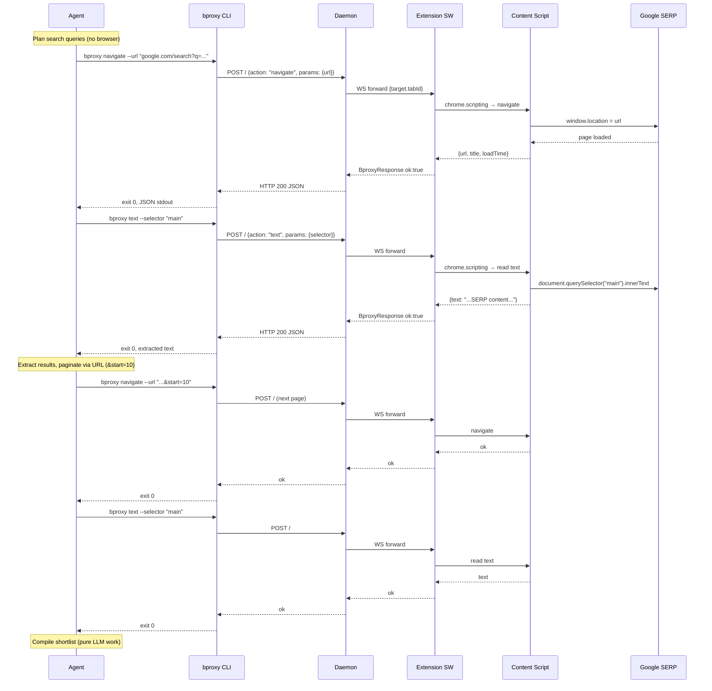

Sequence view for [Scenario 1 — Google topic research](../../scenarios.md#scenario-1--google-topic-research). The agent performs URL-driven search, reads SERPs, and compiles a shortlist. No synthetic events are dispatched.

## Key observations

- **Zero synthetic events** — navigation is URL-driven, reads are ISOLATED-world DOM access.
- **Pacing is daemon-enforced** — the CLI's `--timeout` sets the deadline; the daemon's per-session pacing delays between navigations.
- **HUMAN_REQUIRED** triggers on CAPTCHA/sign-out — the agent would receive exit `1` with error code `HUMAN_REQUIRED` and halt.
- **Request correlation** — each CLI invocation generates a `crypto.randomUUID()` id that flows through daemon logs and extension trace buffer.
