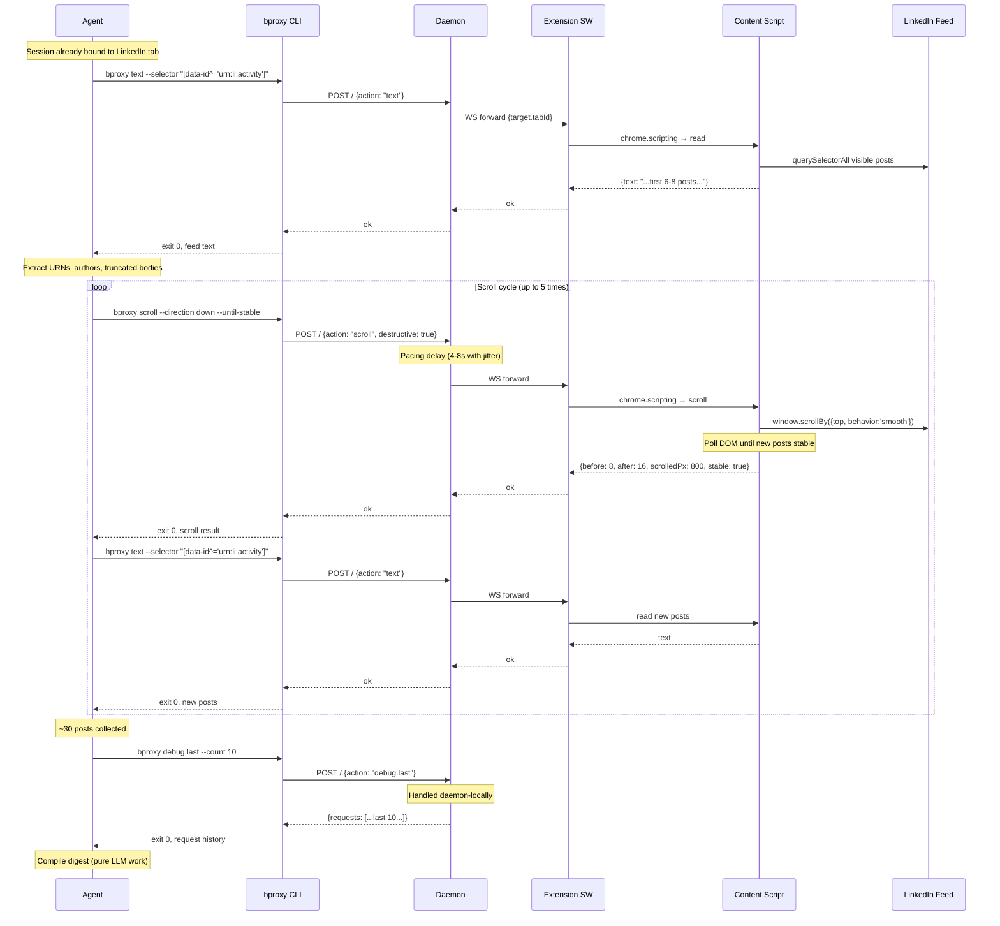

Sequence view for [Scenario 2 — LinkedIn daily feed snapshot](../../scenarios.md#scenario-2--linkedin-daily-feed-snapshot). The agent scrolls the feed, reads lazy-loaded posts, and compiles a digest. Scroll is the only write-like action; all reads are ISOLATED-world DOM access.

## Key observations

- **Scroll is the only "write"** — classified as destructive, but produces no synthetic user events (uses `window.scrollBy` with native smooth behaviour).
- **DOM polling, not MutationObserver** — the content script polls for new `[data-id]` elements after each scroll, never installs listeners.
- **Pacing is daemon-enforced** — 4–8 seconds between scrolls with jitter, configured via `session bind --pacing human`.
- **Feed truncation accepted** — the agent captures truncated bodies; full-body retrieval (via permalink) is on-demand later.
- **`debug.last`** — daemon-local, does not require extension; lets the agent inspect its own recent commands.
- **HUMAN_REQUIRED** — if LinkedIn shows a challenge during scrolling, the daemon pauses the session and all subsequent commands return the error until `session resume`.
