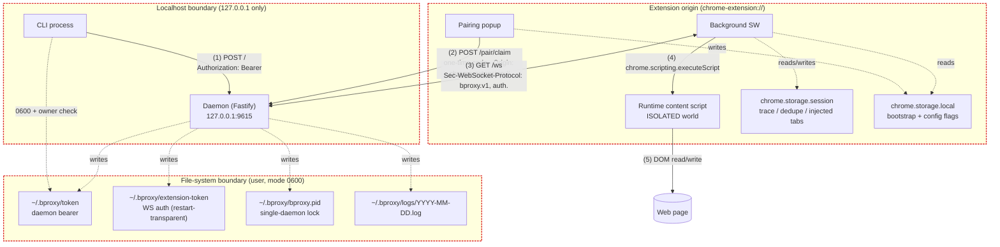

Trust boundaries and STRIDE notes for the daemon **and the shipped Phase 3 extension surface**. This view documents current code and configuration, not future intent.

## STRIDE — daemon and transport

| Class | Threat | Mitigation | Anchor |
|---|---|---|---|
| **S**poofing | Another process binds the daemon port for the same user | PID lockfile per `BPROXY_HOME`; `start` exits non-zero when the lock points at a live PID | `lifecycle.ts:startDetached`; Gap E *"start fails cleanly when daemon already running"* |
| **S**poofing | Other-user process reads the daemon token | Token file mode `0600` + owner UID check; daemon refuses to start (and CLI must refuse to use) any token with wrong mode/owner | `lifecycle.ts:assertOwnerMode600` (`INSECURE_TOKEN_FILE`); Gap E *"token file is created and readable only by owner"* |
| **S**poofing | Cross-site fetch from a malicious page reaches the daemon | Three-layer header gate at `onRequest`: Host pinned to `127.0.0.1:port` / `localhost:port`; Origin must be absent (CLI) or `chrome-extension://*` (popup/WS); `Sec-Fetch-Site` rejected unless `none` / `same-origin` | `auth.ts:checkHost/checkOrigin/checkFetchSite`; Gap C negative tests |
| **S**poofing | Wrong extension instance claims the pairing code | One-time consumption + 5-min TTL + constant-time compare + `chrome-extension://` Origin required; single-active-token policy invalidates previously claimed extension tokens | `pairing.ts`; `auth.ts:checkOrigin('pair')`; [service spec § Pairing bootstrap route](../solution/service.md#pairing-bootstrap-route-post-pairclaim) |
| **T**ampering | Daemon token file is replaced by another user | Owner check rejects tokens whose `st.uid` differs from `process.getuid()` | `lifecycle.ts:assertOwnerMode600` |
| **R**epudiation | "Did command X run? When? Through which client?" | Every lifecycle event carries request `id`: `received` → `pacing_wait?` → `forwarded` → `response` (or `timeout` / `replay`) | daemon observability suites |
| **I**nformation disclosure | Daemon API exposed beyond localhost | Bind host fixed to `127.0.0.1`; Host header verified at the auth gate even if a proxy rewrites it | `config.ts`; `auth.ts:checkHost` |
| **I**nformation disclosure | Token leaks via insecure file mode | Read-side preflight on every token load fails closed with `INSECURE_TOKEN_FILE` / `INSECURE_EXTENSION_TOKEN_FILE` | `lifecycle.ts:assertOwnerMode600`; Gap E file-semantics tests |
| **D**enial of service | Unbounded pending-request map | Hard cap of 100 in-flight requests → `OVERLOADED` | `pending.ts`; `pending.test.ts` |
| **D**enial of service | Head-of-line blocking across tabs | Per-tab FIFO queue, parallel across tabs | `dispatch.ts:withTabLock`; `dispatch.test.ts` |
| **D**enial of service | Pairing-code brute force | One-time consumption + 5-min TTL + constant-time compare; full per-source limiter is deferred | `pairing.ts` |
| **E**levation of privilege | Extension token grants command issuance | Two-token model: bearer auth only valid on `POST /`; subprotocol auth only valid on `GET /ws`; tokens never cross routes | `auth.ts:checkCommandAuth/checkWsAuth` |
| **E**levation of privilege | Pairing endpoint accepts CLI bearer | `POST /pair/claim` is body-auth only (pairing code) and requires `chrome-extension://` Origin | [service spec § Auth Gate](../solution/service.md#auth-gate) |

## Phase 3 extension surface

| Surface | Risk | Shipped mitigation |
|---|---|---|
| Bootstrap token in extension storage | Long-lived WS auth material could leak through loose storage handling | Popup validates payload shape before write; bootstrap is stored as one atomic `chrome.storage.local` record; daemon still limits auth to localhost WS with subprotocol token |
| Runtime content script | Page-visible extension presence or broad ambient listeners | No declarative `content_scripts`; runtime script is injected only on first command per tab; content host keeps one `chrome.runtime.onMessage` listener and no page-global hooks |
| MAIN-world execution | Page learns about the extension or receives raw extension errors/stacks | MAIN world is one-shot only via `chrome.scripting.executeScript({ world: "MAIN" })`; injected functions catch/normalize errors and contain no identifying literals ([ADR-013](../decisions.md#adr-013-main-world-runtime-api-writes), [ADR-015](../decisions.md#adr-015-main-world-hygiene-contract)) |
| Trace / dedupe ring buffer | `debug.log` could expose stale or over-broad extension data | Trace is bounded in `chrome.storage.session`, queryable only through authenticated daemon forwarding, filtered by `id`/`limit`, and stamped with `extensionVersion` |
| Polling / DOM settle | High-signal instrumentation or bundle hygiene regressions | No `MutationObserver`; jittered polling only; Task 16 scans the production artifact to keep `MutationObserver` out of shipped output |
| Screenshot escalation | `chrome.debugger` would widen capability and show a user-visible Chrome banner | Normal screenshots use `captureVisibleTab`; debugger screenshots remain gated behind `DEBUGGER_DISABLED`, with no `debugger` permission in the manifest today |
| Web-accessible resources | Deterministic extension-resource probing by pages or scanners | `web_accessible_resources` is absent by default; build hook strips WXT's empty array stub so the manifest stays default-deny ([ADR-016](../decisions.md#adr-016-web_accessible_resources-default-deny)) |
| Hidden-tab destructive actions | Writing to a background tab may produce misleading state or bot-signal issues | Content polling checks `document.visibilityState` and destructive actions bail with `TAB_NOT_VISIBLE` unless future protocol metadata explicitly opts into user-initiated hidden-tab behavior |

## Still out of scope

- Process-level sandboxing of the daemon (e.g. `seccomp`, App Sandbox profile)
- Enforced pairing-code rate limiting beyond the current structural plumbing
- Cross-host operation or TLS; bproxy remains localhost-only
- Closed shadow-root support
- A shipped opt-in path for `chrome.debugger` screenshots
- A daemon/CLI control path that enables `eval`; default behavior remains `EVAL_DISABLED`

## See also

- [02-containers](./02-containers.md) — runtime processes and wire protocols.
- [04-session-state](./04-session-state.md) — daemon pause/bind gating that sits behind the transport.
- [service spec](../solution/service.md) and [extension spec](../solution/extension.md) — normative behavior.
- [ADR-010](../decisions.md#adr-010-websocket-auth-transport--two-token-model), [ADR-011](../decisions.md#adr-011-extension-token-bootstrap-via-popup-driven-pairing), [ADR-013](../decisions.md#adr-013-main-world-runtime-api-writes), [ADR-015](../decisions.md#adr-015-main-world-hygiene-contract), [ADR-016](../decisions.md#adr-016-web_accessible_resources-default-deny).
