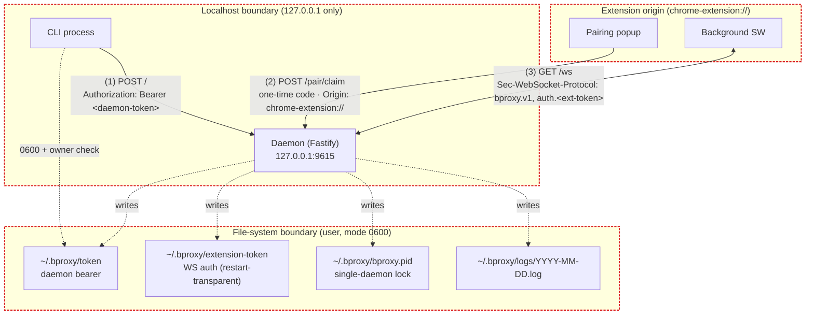

Trust boundaries and STRIDE notes for the daemon as shipped in Phase 2. Every mitigation listed here is anchored to a tested invariant in `service/src/__tests__/`; this view documents what the code already does, not future intent.

## STRIDE

| Class | Threat | Mitigation | Anchor |
|---|---|---|---|
| **S**poofing | Another process binds the daemon port for the same user | PID lockfile per `BPROXY_HOME`; `start` exits non-zero when the lock points at a live PID | `lifecycle.ts:startDetached`; Gap E *"start fails cleanly when daemon already running"* |
| **S**poofing | Other-user process reads the daemon token | Token file mode `0600` + owner UID check; daemon refuses to start (and CLI must refuse to use) any token with wrong mode/owner | `lifecycle.ts:assertOwnerMode600` (`INSECURE_TOKEN_FILE`); Gap E *"token file is created and readable only by owner"* |
| **S**poofing | Cross-site fetch from a malicious page reaches the daemon | Three-layer header gate at `onRequest`: Host pinned to `127.0.0.1:port` / `localhost:port`; Origin must be absent (CLI) or `chrome-extension://*` (popup/WS); `Sec-Fetch-Site` rejected unless `none` / `same-origin` | `auth.ts:checkHost/checkOrigin/checkFetchSite`; Gap C negative tests |
| **S**poofing | Wrong extension instance claims the pairing code | One-time consumption + 5-min TTL + constant-time compare + `chrome-extension://` Origin required; single-active-token policy invalidates previously claimed extension tokens | `pairing.ts`; `auth.ts:checkOrigin('pair')`; [service spec § Token activation contract](../solution/service.md#pairing-bootstrap-route-post-pairclaim) |
| **T**ampering | Daemon token file is replaced by another user | Owner check rejects tokens whose `st.uid` differs from `process.getuid()` | `lifecycle.ts:assertOwnerMode600` |
| **R**epudiation | "Did command X run? When? Through which client?" | Every lifecycle event carries the request `id` per [ADR-009](../decisions.md#adr-009-observability-as-a-first-class-design-constraint): `received` → `pacing_wait?` → `forwarded` → `response` (or `timeout` / `replay`) | Gap D observability contract suite |
| **I**nformation disclosure | Daemon API exposed beyond localhost | Bind host fixed to `127.0.0.1` (`config.ts:DEFAULT_HOST`); Host header verified at the auth gate even if a proxy rewrites it | `config.ts`; `auth.ts:checkHost` |
| **I**nformation disclosure | Token leaks via insecure file mode | Read-side preflight on every token load fails closed with `INSECURE_TOKEN_FILE` / `INSECURE_EXTENSION_TOKEN_FILE` | `lifecycle.ts:assertOwnerMode600`; Gap E file-semantics tests |
| **D**enial of service | Unbounded pending-request map | Hard cap of 100 in-flight requests → `OVERLOADED` | `pending.ts` `maxSize`; `pending.test.ts` |
| **D**enial of service | Head-of-line blocking across tabs | Per-tab FIFO queue, parallel across tabs | `dispatch.ts:withTabLock`; `dispatch.test.ts` *"runs commands targeting different tabs in parallel"* |
| **D**enial of service | Pairing-code brute force | One-time consumption + 5-min TTL + constant-time compare; per-source rate limit is structural plumbing only — full limiter deferred per [service spec § Out of scope](../solution/service.md) | `pairing.ts` |
| **E**levation of privilege | Extension token grants command-issuance | Two-token model ([ADR-010](../decisions.md#adr-010-websocket-auth-transport--two-token-model)): bearer auth only valid on `POST /`; subprotocol auth only valid on `GET /ws`. Tokens never cross routes. | `auth.ts:checkCommandAuth/checkWsAuth`; Gap C *"WS connection fails without valid extension token"* |
| **E**levation of privilege | Pairing endpoint accepts CLI bearer | `POST /pair/claim` is body-auth only (pairing code). No bearer accepted on this route — Origin must be `chrome-extension://` and the code is the auth factor | [service spec § Auth Gate](../solution/service.md#auth-gate); Gap C *"pair/claim works without daemon token"* |

## Out of scope (today)

- **Process-level sandboxing** of the daemon (e.g. `seccomp`, `App Sandbox` profile). The daemon trusts the local user account; defense-in-depth at the OS level is deferred.
- **Pairing-code rate limiter as enforced rule.** The schema and error code (`PAIRING_RATE_LIMITED`) exist; the actual per-source counter lands when `eval`/abuse surfaces exist.
- **Extension-side threats.** Content-script isolation, MAIN-world `eval`, ring-buffer leakage — those belong to a future *Extension threat model* once Phase 3 ships.
- **Transport encryption.** All traffic is localhost; no TLS. Cross-host operation is explicitly not supported.

## See also

- [02-containers](./02-containers.md) — the three processes and their wire protocols.
- [04-session-state](./04-session-state.md) — what the auth gate actually protects when forwarded commands arrive.
- [ADR-010](../decisions.md#adr-010-websocket-auth-transport--two-token-model) and [ADR-011](../decisions.md#adr-011-extension-token-bootstrap-via-popup-driven-pairing) — the decisions that shape this surface.
- [service spec § Auth Gate](../solution/service.md#auth-gate) — normative source.
